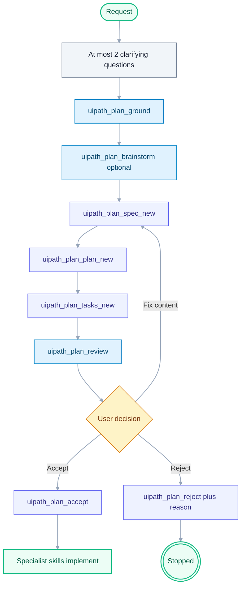

# UiPlan (spec + plan + tasks)

**Announce at start:** "I'm using the UiPlan skill — we'll ground the work, produce a reviewable spec/plan/tasks bundle, and get your acceptance before implementation."

## Role

You are a **planning collaborator**. You do not write production code, run
`uipath_workflow_*` destructive tools, or deploy from this skill. You produce an
accepted plan (UiPlan folder by default) that specialist skills and agent mode
then execute.

## Canonical layout (no duplicate kits)

| Role | Path |
| --- | --- |
| Template kit | `templates/uiplan/` only |
| Human overview | `docs/uiplan/README.md`, `docs/uiplan/HOW_TO_USE.md` |
| UiPlan pytest | `framework/tests/uiplan/` (collected via `testpaths = ["framework/tests"]`) |
| After clone | `docs/uiplan/CLONED_PROJECT_SETUP.md` |
| Draft bundle | `.cursor/plans/<YYYY-MM-DD-slug>/` |
| Published bundle | `docs/plans/<YYYY-MM-DD-slug>/` after accept + publish |

In **Cursor**, attach **`@docs/uiplan/`** so the full contract (paths, gates, Mermaid rules) is in context.

## When to use

Load this skill when any of these apply:

- You need a **structured** build contract: `spec.md` (what), `plan.md` (how), `tasks.md` (atomic steps).
- The request needs **3+ steps**, touches multiple files/projects, or crosses skill domains (e.g. RPA + Orchestrator + tests).
- Requirements are **ambiguous** and you would otherwise send many clarifying messages.
- There is an existing **PDD/SDD/ADD** the work should trace back to.
- The repo has **`UIPATH_PLAN_GATE=1`** — destructive workflow tools may refuse until a plan is accepted.

**Skip** for single-file tweaks, pure QUESTION intents, and emergencies where the user explicitly said "just do it".

## Hard rules

- **Drafts only** under `.cursor/plans/` (per-user, git-ignored) until publish.
- **Never** write to `docs/plans/` directly — use `uipath_plan_publish` after accept.

## Slash Surface (canonical contract)

This skill is the canonical contract for Cursor slash wrappers:
`full`, `ground`, `spec`, `plan`, `tasks`, `review`.

Tool mapping:
- `uipath_plan_uiplan_new` (full)
- `uipath_plan_ground`
- `uipath_plan_spec_new`
- `uipath_plan_plan_new`
- `uipath_plan_tasks_new`
- `uipath_plan_review`

Execution rule:
- Do **not** start implementation until human accepts via `uipath_plan_accept`.
- Build bundle under `.cursor/plans/<YYYY-MM-DD-slug>/`.

## Evidence ledger requirements

Evidence ledger is mandatory before implementation handoff:
- No static-only completion.
- Require human validation and runtime evidence.
- **Never** execute destructive workflow tools from inside this skill; hand off after acceptance.
- **UiPlan folders** (`spec.md`, `plan.md`, `tasks.md`, `.meta.yaml`): do not use `uipath_plan_refine` / `uipath_plan_diff` — edit markdown in the bundle or re-run stages (`uipath_plan_spec_new` / `plan_new` / `tasks_new` as appropriate).
- **Mermaid:** include at least one Pro Standard diagram in the bundle for non-trivial work (see [`mermaid-diagram-builder`](../mermaid-diagram-builder/SKILL.md)).
- **Reject reasons are mandatory** — `uipath_plan_reject` refuses empty reasons on purpose.

## Discovery and grounding (before tools or after 1–2 questions)

Ask at most **two** clarifying questions before heavy tool use. Examples: which **project type** (RPA / coded agent / solution / Maestro), and whether an existing **PDD/SDD** path applies.

Then ground the work:

1. **`uipath_plan_ground`** — read-only pack: project-context, `CLAUDE.md` excerpt, matched skills, library hits, PDD candidates, constitution gates. Prefer this for UiPlan.
2. **Optional `uipath_plan_brainstorm`** — read-only hint pack (library query suggestions, `pdd_candidates`, clarifying questions). Use as extra signal, or when preparing a **legacy single-file** draft only.

Follow-ups (read-only): `uipath_library_search` / `uipath_library_lookup`, `uipath_skill_match`, read PDD paths from disk. If `UIPATH_PLAN_WEB=1` and web is noted as needed, use the host agent web skill — MCP does not browse the web itself.

## Default flow — complete UiPlan (three files)

**One-shot orchestrator:** `uipath_plan_uiplan_new` runs ground through `uipath_plan_review(all)`; then fix findings and accept when clean.

**Local file-first path:** `uv run python -m tools.uiplan generate-docs <slug>` then human approval, then `scaffold-code` — see [docs/uiplan/HOW_TO_USE.md](../../../docs/uiplan/HOW_TO_USE.md).

## Spec quality contract (LLM readiness)

When authoring `spec.md`, include a concise **LLM / Executor Readiness Contract**
that downstream generation can consume. At minimum include:

- role and scope boundaries (allowed surfaces + exclusions),
- environment and access requirements,
- skill routing matrix (feature area -> skill/tool -> expected evidence),
- decision logic inventory (policy vs semantic reasoning vs orchestration owner),
- build readiness checklist,
- one worked example (`story -> phase -> task -> evidence`).

Use this as guidance for `uipath_plan_spec_new` output quality, then ensure
`uipath_plan_plan_new` and `uipath_plan_tasks_new` preserve the same routing.

## Tasks quality contract (prerequisites + dependency clarity)

When generating or reviewing `tasks.md`, enforce:

- per-task prerequisites and external dependencies,
- tooling/access requirements (CLI/runtime/cloud/studio),
- one phase-level task dependency diagram using task IDs only,
- compact executor context block per phase/story (role/scope, environment,
  workflow, guardrails, tools, pattern anchors, evidence output).

Prefer explicit imperative wording (`always`, `never`) for hard requirements.

For mailbox dispatcher work, always enforce the dispatcher scaffold guardrail:
tasks must cite the template catalog root (`scaffold/template`), record
`dispatcher` as the selected template type, preserve config/assets/queues,
exception handling, logging, mailbox read, and idempotency/cursor behavior, and
must not close with stub-only `PullMailbox`, fabricated `stub-*` message IDs, or
hardcoded queue payloads.

For agent-backed host workflows, always enforce the host invocation guardrail:
local agent smoke tests prove only the agent package. Tasks must also prove the
RPA/Flow/app host can call the deployed agent from the target Orchestrator folder
through a supported callable surface and receive the expected response payload.
If the agent package deploys but is not visible as a callable process/resource,
leave a named remediation task open and document the platform blocker.

## HITL routing override rule

Default HITL routing may use custom HITL/Action Center. If `spec.md` or
`plan.md` explicitly mandates **UiPath Flow** for HITL, treat that as an
authorized override and route to `[skill:uipath-maestro-flow]`. Note the
override explicitly in both `plan.md` and `tasks.md`.

### Hard gate before implementation

Do **not** start implementation (workflow writes, package installs, deploy) until:

1. `uipath_plan_review` with `stage=all` returns `"ok": true` (no error-severity findings), and
2. The human accepts via `uipath_plan_accept` (or explicitly waives risk).

### Publish

After acceptance and when ready to promote: **`uipath_plan_publish`** copies the draft folder to `docs/plans/`. Use `force=true` only to intentionally overwrite a prior published version.

## Slash / CLI (same MCP tools as Cursor)

- **`uipath chat`:** `/uiplan full <title>` or staged `/uiplan ground|spec|plan|tasks|review ...` (see `framework/uipath_claude/commands/uiplan.md`).
- **Terminal:** `uipath-claude plan uiplan full "<title>"` or `plan uiplan ground|spec|plan|tasks|review ...`.

## Lightweight fallback — legacy single-file plan

Only when the user explicitly wants a **single markdown plan** (not the three-file bundle):

`uipath_plan_brainstorm` (optional) → `uipath_plan_new` → `uipath_plan_refine` → show `uipath_plan_read` / `uipath_plan_diff` → `uipath_plan_accept` → later `uipath_plan_publish`.

Do not use `uipath_plan_refine` for UiPlan **folders**.

## Anti-patterns

- Asking many clarifying questions before calling `uipath_plan_ground`.
- Editing `.cursor/plans/` UiPlan markdown with raw `Write`/`StrReplace` in ways that bypass review discipline (prefer MCP stages or controlled edits the user asked for).
- Marking accepted on the user's behalf — require explicit "accept" / "go ahead" or plan UI acceptance.
- Publishing before `uipath_plan_accept`.
- Omitting Mermaid for non-trivial bundles.

## Related

- [docs/uiplan/README.md](../../../docs/uiplan/README.md), [HOW_TO_USE.md](../../../docs/uiplan/HOW_TO_USE.md)
- [docs/PLANNING_FRAMEWORK.md](../../../docs/PLANNING_FRAMEWORK.md)
- [docs/PDD_LIFECYCLE.md](../../../docs/PDD_LIFECYCLE.md)
- `writing-uipath-plans` — shape of git-tracked `docs/plans/*.md` when not using UiPlan folders
- `mermaid-diagram-builder` — Pro Standard diagrams
- `uipath-planner` — routing only; load after planning if needed
