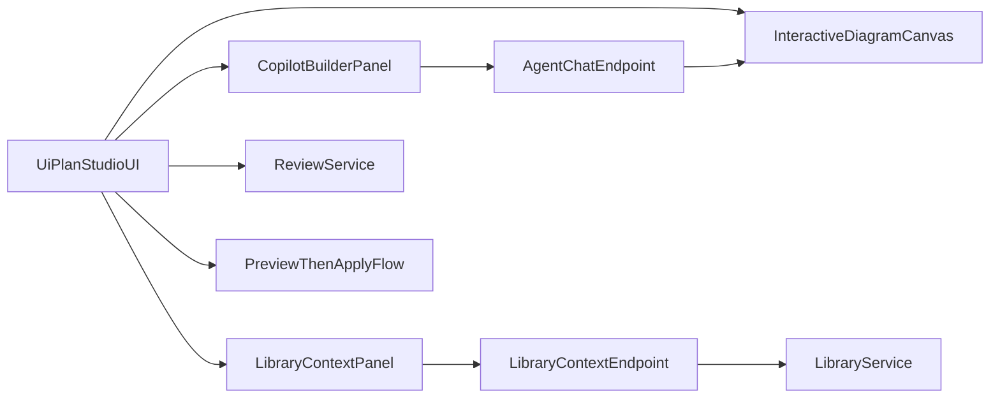

# UiPlan Studio

UiPlan Studio is a local-first visual builder for exploring and planning UiPath automation projects. It provides:

- **Source folder mapping**: Point to any folder and let Copilot infer the project structure
- **Project graph visualization**: Browse skills, UiPlan bundles, and project files in an interactive canvas
- **UiPlan planning docs**: View and track planning documents (spec.md, plan.md, tasks.md) with phase-based task flow

## Current Product Surface

The productized Studio focuses on:

1. **Source Folder Mapping**: Add a folder path → map it with Copilot → explore the generated project graph
2. **UiPlan Bundles**: Discover planning documents from `examples/uiplan-demo/`, `.cursor/plans/`, or project roots
3. **Skill Discovery**: Browse skills from the catalog, see metadata-rich visualizations, and jump to matched project nodes

The backend API provides:

- `POST /mapping/map-folder`: Copilot-first project mapping with folder validation
- `GET /explorer/graph?worktree=<path>`: Legacy deterministic indexing (retained for direct URL support)
- `GET /explorer/skills/<id>`: Skill detail with enhanced metadata for visualization

## User Workflow

1. **Map a source folder**: Enter a folder path in the source control, click MAP
2. **Choose view mode**: Toggle between **FOCUS** (entry points + children) and **FULL** (all nodes)
3. **Explore the graph**: Browse the project map view to see files, skills, and UiPlan bundles
4. **Expand nodes** (Focus mode): Double-click any node to see its immediate children
5. **Select a UiPlan bundle**: Click a bundle in the left rail to see its phase flow and task progress
6. **Select a skill**: Click a skill node to see triggers, capabilities, outputs, and matched project nodes
7. **Refresh**: Click REFRESH to re-map the current folder if files changed

### View Modes

- **FOCUS Mode** (default): Hierarchical view starting from entry points (Main.xaml, main.py, etc.). Perfect for large projects (50+ nodes). Double-click to expand node children dynamically.
- **FULL Mode**: Shows all indexed nodes. Best for small projects (< 30 nodes) or comprehensive audits.

See `docs/VIEW_MODES.md` for details on entry point detection, expansion, and performance tips.

See `docs/INTEGRATIONS.md` for how external integrations and Orchestrator resources are automatically detected and visualized.

The UiPlan Studio is a read-only explorer for this productized version. Generation, editing, and deployment features are deferred.

## Example Bundle

The repository includes a reference UiPlan bundle at `examples/uiplan-demo/` demonstrating the three-file structure:

- **spec.md**: Requirements, context, constraints, success criteria
- **plan.md**: Decisions, architecture diagrams, component descriptions
- **tasks.md**: Actionable work items organized by phase with checkboxes

See `examples/uiplan-demo/` for the canonical template.

Core nodes (`spec`, `plan`, `tasks`, `skills`, `library`, and `review`) are protected from
deletion. Non-core nodes can be added from context sources, Copilot suggestions, or manual
inspector edits. Saved diagrams remain permissive for freeform nodes, but server-side
sanitization strips unavailable curated source IDs/paths before the diagram is persisted or used
as generation context.

## Context Sources

Studio exposes context through `/agent/context-sources` and `/context/sources`. Current source
categories include:

- UiPath skills and skill metadata.
- UiPath library books and sections.
- Bundle documents (`spec.md`, `plan.md`, `tasks.md`).
- Review/readiness context and findings.

Library search uses `POST /agent/library-context`. Returned snippets can be included in
generation requests and are annotated with source citations such as `book/chapter/section`.

## Copilot Runtime And Fallback

The frontend is wrapped in `@copilotkit/react-core` and points at the local API runtime at
`/copilotkit`. The backend exposes:

- `GET /copilotkit/info` for runtime metadata and action lists.
- `POST /copilotkit` for the GraphQL-style requests issued by the frontend runtime.
- `/copilotkit/runtime` when the Python `copilotkit` SDK is available in the service
  environment.
- `POST /agent/chat` as the deterministic local fallback chat surface.

Builder actions are intentionally safe: they can list context sources, load source metadata,
search library snippets, suggest diagram nodes, summarize the canvas, and draft package requests.
They do not apply proposal content. Proposal writes still require explicit preview/apply through
the generation package endpoints.

The local `/copilotkit` GraphQL-style endpoint is a compatibility shim for the current frontend
runtime protocol. It returns action metadata and static success envelopes with no generated
assistant messages; deterministic local chat remains on `/agent/chat`, and full hosted Copilot
runtime behavior is limited to environments where the Python CopilotKit SDK endpoint is
available at `/copilotkit/runtime`.

Use the service-local `uv` environment for backend commands. The repo-root Python environment
does not own the Studio API dependencies and may not have the `copilotkit` SDK installed.

## Diagram-To-Document Generation

`POST /generation/packages` produces Plan or Scaffold approval packages from the current typed
graph. `GET /generation/packages` and `GET /generation/packages/{package_id}` expose package
manifests, approval state, stage manifests, and file proposals for review.

Studio submits generation requests with both:

- `graph`: full typed graph snapshot from the current canvas workspace.
- `graph_ref`: request metadata (`graph_id`, `selected_node_id`) copied from that snapshot.

The API enforces `write_policy: approval_package_only` for `/generation/packages`. Any other
write policy is rejected so package generation always stays preview-first.

`POST /generation/packages/{package_id}/proposals/{proposal_id}/preview` creates a guarded preview
for a proposal. `POST /generation/packages/{package_id}/proposals/{proposal_id}/apply` applies
only after approval state and preview id checks pass.

No package route writes target source files during generation. File updates are allowed only from
explicit proposal apply paths after reviewer approval.

Generated diagram sections are delimited with `uiplan-diagram-generated` markers so a later
preview can replace only the generated block while preserving surrounding hand-authored
content.



## Local Run And Verification

From repo root, run the submodule guard before final handoff:

```bash
python -m uipath_claude.skills.submodule_guard
```

Run backend Phase 0 verification from the service directory so `uv` uses the Studio API
environment:

```bash
cd studio/api
uv sync
uv run pytest tests/test_generation_contract_schemas.py tests/test_approval_state.py tests/test_path_allowlist_command_registry.py tests/test_approval_package_storage.py tests/test_stage_package_generation.py tests/test_main.py -q
```

Run frontend Phase 0 verification from repo root:

```bash
npm --prefix studio/web test -- src/__tests__/generationTypes.test.ts src/__tests__/ApprovalPackagePanel.test.tsx src/__tests__/App.test.tsx
npm --prefix studio/web run build
npx --prefix studio/web playwright test e2e/library-context.spec.ts
```

To run interactively during development:

```bash
cd studio/api
uv run uvicorn app.main:app --reload --port 8000

# In another terminal, from repo root:
npm --prefix studio/web run dev
```

The UI expects the API on `http://localhost:8000` by default. Override it with
`VITE_UIPLAN_API_URL` when running against another local port.

## Limitations And Constraints

- Adapter-first UI boundary: `AgentPanel` exposes builder chat and safe actions only
  (`Draft Plan package request`, `Draft Scaffold package request`, and context requests).
- Document edits and generation are preview-first and explicit-apply: proposed content must be
  reviewed via diff and then applied through a dedicated apply action in the backend flow.
- Copilot package drafting is preview-only and returns request payloads for `/generation/packages`;
  it does not apply proposals or write target files.
- `/generation/packages` accepts only `write_policy: approval_package_only`; this preserves
  preview-first package creation and keeps target-file writes behind proposal preview/apply.
- The `/copilotkit` compatibility shim does not stream or synthesize chat messages; it only
  keeps the frontend protocol connected to local action metadata.
- Studio must not publish or deploy packages/processes. Publish/deploy remain external,
  user-approved operations outside this UI.
- Stage controls for `03-code`, `04-tests`, and `05-validation` are intentionally disabled in
  Phase 0.
- The local fallback chat is deterministic and intentionally narrow; it is not a full hosted
  Copilot agent.
- Pending previews are in memory. Restarting the API clears unapplied previews.
- Saved diagrams live with draft bundles under `.cursor/plans/<slug>/`, which are local
  draft artifacts unless explicitly published through the UiPlan lifecycle.
- Build artifacts such as `dist/`, `.venv/`, `.pytest_cache/`, and `node_modules/` should stay
  uncommitted local artifacts.
