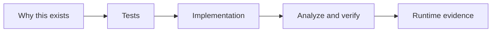

# UiPlan task authoring contract

Use this guide when writing or reviewing `tasks.md`. The goal is to make
`/uiplan-implement` follow instructions instead of inventing architecture during
coding.

Prerequisite: read [README.md](README.md) and [HOW_TO_USE.md](HOW_TO_USE.md)
first for onboarding, path selection (Cursor/CLI/MCP), and lifecycle flow.
This document is the advanced execution-quality contract.

**Evidence contract:** every task involving activities, Orchestrator resources,
deployment/smoke, or UAT/test-case claims must follow the guidance in
[ACTIVITY_AND_RUNTIME_EVIDENCE.md](ACTIVITY_AND_RUNTIME_EVIDENCE.md). That
document defines the canonical grounding, provisioning, validation, and proof
requirements. This document (TASK_AUTHORING.md) focuses on task structure,
ordering, and execution loops; ACTIVITY_AND_RUNTIME_EVIDENCE.md is the detailed
evidence playbook.

## 360 tasking objective

`tasks.md` must execute the `spec.md` 360 visibility contract without gaps. For
every in-scope artifact/surface declared in spec/plan, there must be:

- an explicit task ID (or task group) that builds it;
- a verification command;
- an evidence output path;
- an internal-step workflow diagram for executable workflow artifacts.

If any artifact cannot be mapped to those four elements, stop and fix `spec.md`
or `plan.md` before continuing.

## Project Graph handoff

`plan.md` `## Project Graph` is the canonical source for graph-shaped planning
inputs: Mermaid source blocks, task/todo source lists, context sources,
generation stages, and graph-to-package mappings. When authoring `tasks.md`, use
that section to derive task dependencies, package/project ownership, and evidence
nodes instead of creating a separate graph vocabulary.

## Capability routing baseline

`tasks.md` should consume routing already captured in `plan.md` and use the
minimal required capability set for each task (skill/agent/subagent/library/doc
lookup + CLI gate). Do not re-open broad onboarding-level routing here; keep
this file focused on executable artifact-level instructions and evidence.

## Discovery boundary

Discovery is a precondition to task authoring, not a task output.

- Run project discovery and architecture routing in `/uiplan-ground` and `/uiplan-plan`.
- Capture project surfaces, template decisions, bindings/contracts, and activity lookup
  context in `plan.md` before generating `tasks.md`.
- If those inputs are missing, stop and return to plan/grounding stages.

`tasks.md` should begin when the team already knows what to build.

## Retrospective carry-forward checks

When prior project transcripts expose delivery gaps, encode them directly in the
next `tasks.md` contract instead of treating them as one-off fixes. At minimum:

- require explicit scaffold/template provenance for workflow families
  (especially dispatcher-style mailbox intake, long-running AnalyzerRunner, and
  HITL review surfaces), including a physical copy/export source and target path
  when a named project template exists;
- treat named templates as build constraints: tasks must preserve the runtime
  shape of Dispatcher, Performer, Long Running Workflow, Flow HITL, or coded
  agent scaffolds unless the accepted plan records an equivalent replacement;
- require the named-template lifecycle in the task sheet: copy/export the
  template, read/inspect the copied workflows/config/arguments/variables/
  dependencies/extension points, preserve generated control flow, customize the
  copied shell in place for the specific business process, and verify the
  customized shell;
- treat dispatcher templates as host shells: copying the template is only the
  first task, and the task sheet must then wire the specific business process
  into the copied shell's config, process workflow, logical components, queue
  payload, logging, and smoke evidence;
- treat Long Running Workflow / AnalyzerRunner templates as host shells: after
  copying or scaffolding, tasks must wire queue item handling, wait/resume,
  coded-agent invocation, response mapping, status transitions, and
  correlation-aware logging into the copied shell;
- treat HITL templates as host shells: after copying or scaffolding, tasks must
  wire review schema, allowed outcomes, timeout/escalation behavior, return path,
  and downstream update logic into the copied shell;
- require runtime evidence from real connector intake, not fabricated payloads;
- require one diagram + one activity checklist row per workflow artifact;
- require the standard visual set to carry forward from `spec.md` and
  `plan.md`: business process, architecture, runtime sequence, decision tree,
  workflow internals, and evidence coverage;
- require Studio-visible phase + correlation logging assertions in final evidence.

## Persona checkpoints

Before acceptance, review a non-trivial UiPlan bundle through these lenses:

- **BA checkpoint**: business process, actors, inputs/outputs, scope, SME
  questions, acceptance criteria, and open policy decisions.
- **SA checkpoint**: solution topology, project split, workflow type per project,
  queues/assets/connections, deployment gates, and handoff boundaries.
- **Dev checkpoint**: artifact paths, package dependencies, activity/SDK/CLI
  constructs, implementation order, local build loop, and generated-file rules.
- **QA/Test checkpoint**: fixture data, test commands, analyzer outputs, runtime
  evidence, failure-path validation, and smoke criteria.

Unresolved choices must be assigned to a persona, skill, or explicit blocker.
Use `[SME REVIEW: ...]` or `[NEEDS CLARIFICATION: ...]` for human decisions.

## Workflow design before tasking

Every non-trivial UiPath task set must name the build surface and workflow shape:

- RPA / Studio: Sequence, Flowchart, State Machine, Long Running Workflow,
  Dispatcher/scheduled intake, Performer/queue worker, HITL handler, or another
  named Studio template.
- Coded agent: LangGraph / LlamaIndex descriptor, graph entry point, nodes,
  request/response schema, host invocation boundary, pytest/JUnit evidence,
  direct graph/function smoke output, and `uipath run` evidence or a documented
  platform-runtime blocker after auth/folder resolution.
- Maestro / Flow: `.flow` / BPMN artifact, trigger, data mappings, solution
  packaging boundary, and `uip flow debug` runtime evidence unless debug is
  unsafe or unavailable.
  On Windows, tasks must also verify `zip` availability for `uip flow debug`
  and keep the solution project folder, `project.uiproj` name, and `.flow`
  filename consistent with the installed CLI's expectations.
- Coded app/action: `app.config.json`, `action-schema.json`, TypeScript entry
  points, and `uip codedapp` build path.
- Platform/config: queues, assets, folders, connections, bindings, policies, and
  deployment approvals.

For each workflow shape, state why it fits the process and what evidence proves
the scaffold/template is correct: Studio-generated files, `uip rpa create-project`
output, existing `project.json` / `project.uiproj`, default activity XAML,
package-local examples, or documented library/skill guidance. If the workflow
shape names a repo or Studio template, the task must copy/export or scaffold
that project into the target folder first, read the copied template, list the
structure and extension points that must remain intact, and then define the
business-process customization tasks inside that copied shell. Do not close a
story with generic "template copied" evidence.

## Task bullet contract

Each non-parallel implementation task must include:

- project or package name;
- workflow / sequence / node / CLI step;
- artifact path in backticks;
- UiPath construct: activity, SDK call, queue, asset, folder, binding, graph,
  process, app, flow, or policy;
- grounding path: skill, agent, library lookup, activity doc, AskAI fallback, CLI
  help, or subagent;
- exact verification command;
- runtime evidence path or artifact.
- prerequisites (task IDs and required pre-existing artifacts);
- external dependencies (systems, permissions, policies);
- tooling/access requirements (CLI/runtime/cloud/studio access needed).

Each story block should also include:

- **Why this exists**: one sentence explaining business/workflow purpose.
- **Workflow/task diagram**: Mermaid visual showing tests, implementation,
  verification, and evidence outputs.
- **Evidence coverage visual**: when the task group spans multiple commands or
  surfaces, show how each command produces an output path and review gate.
- **Dependencies note**: what must be done before this story starts.
- **Executor context**: compact role/scope + environment + workflow +
  guardrails + tools + pattern anchors + output style block.

## 360 traceability row (required)

Near the top of `tasks.md`, include a visibility execution matrix:

| Artifact path | Surface | Owning story | Build task IDs | Verify command | Evidence path |
| --- | --- | --- | --- | --- | --- |
| `projects/<Name>/Main.xaml` | RPA | US1 | `T011A` | `uipcli package analyze ...` | `out/analyze.json` |

This matrix is the fastest check for under-specification and should align with
`spec.md` 360 visibility rows and `plan.md` inventories.

## Deployment task minimum contract

Deployment/publish tasks must never be considered complete from local pack
output alone. For any task that includes `deploy`, `publish`, `activate`,
`upload-package`, `job run`, or `test run`, require:

- explicit target tenant/folder and non-Production boundary;
- required auth inputs (or explicit `[HANDOFF:Secrets]` if withheld);
- exact tenant mutation command(s), not just local build commands;
- activation/setup branch (`download-config` + bindings) when Solutions are used;
- runtime resource provisioning commands for required assets, queues, storage
  buckets, and connections before smoke; non-secret assets/queues should use
  `uip resource`, while credential/secret assets remain `[HANDOFF:Secrets]`
  unless values are explicitly provided;
- evidence that resources exist in the same folder path used by deployed
  processes, plus queue item evidence when queue workflows are in scope;
- runtime evidence from tenant execution (deployment id, job id, final state);
- tenant log evidence after execution (`uip or jobs logs`, `uipcli` job result,
  or equivalent), including deployed package version/dependency evidence for
  coded agents when available;
- blocker class + handoff evidence when tenant mutation is not possible.

If only local evidence exists (restore/analyze/test/pack), mark the task as
`local-ready` and keep deploy/smoke tasks open.

## Placeholder completion is forbidden

Tasks must not treat scaffold-only or placeholder artifacts as implemented
workflow behavior.

- Flow nodes labeled or behaving as `placeholder`, `would invoke`, or
  `contract only` are not complete unless a real callable resource is unavailable
  after registry/process discovery and a remediation task remains open.
- Agent-backed Flow tasks must prove both sides: the agent graph runs locally,
  the deployed entrypoint can be invoked when deployment is in scope, and the
  Flow host has `uip flow debug` evidence for the branch that consumes the
  agent-shaped response.
- RPA tasks with `LogMessage` markers only are scaffold evidence, not production
  behavior, unless the task explicitly says scaffold-only and a production
  wiring task remains open.
- Any platform limitation must include command evidence, searched resource names,
  blocker class, and the closest safe executable smoke test.

Good task:

```text
- [ ] T014 [US1] In `ZipEmail.Dispatcher`, implement the `ReadMailboxMessages`
  sequence in `projects/ZipEmail.Dispatcher/Main.xaml` using Email connector mail
  activities resolved by `uipath_doc_get_activity` and queue guidance from
  `uipath_library_search`; verify with `uipcli package analyze
  projects/ZipEmail.Dispatcher/project.json --resultPath out/dispatcher.json`
  and record analyzer JSON plus a smoke log containing `CorrelationId`.
```

Bad task:

```text
- [ ] T014 Implement the dispatcher workflow.
```

The bad task omits the project, workflow shape, artifact path, activities/docs,
verification command, and runtime evidence.

## Implementation loop

For every task, `/uiplan-implement` should run this loop:

1. Read the task, `spec.md`, and `plan.md`; confirm scope and artifact path.
2. Ground missing details through skills, library/docs, AskAI, CLI help, or
   focused subagents.
3. Develop only the current task scope.
4. Run the task verification command and the relevant analyze/test gate.
5. Parse output files and structured errors, not just console summaries.
6. Compare results against the accepted `spec.md`, `plan.md`, and `tasks.md`.
7. Apply one safe local source/config/tooling fix when evidence supports it.
8. Rerun the same gate and record whether the original issue cleared, changed,
   or remains.
9. Mark complete only with runtime evidence; otherwise leave an explicit blocker
   or handoff.

## Task card table (required for each implementation task)

Use a **task card** immediately before or after each `- [ ] Txxx` bullet for
non-trivial work. Minimum columns:

| Field | Content |
| --- | --- |
| Task ID | Matches checkbox (`T014`). |
| Owning user story | `USn` from `spec.md`. |
| Project type / build surface | RPA/XAML, Flow/Maestro, coded agent, coded app, Solution slice, platform/config. |
| Artifact path(s) | Repo paths in backticks. |
| Workflow / node / activity / resource | Exact construct being built or changed. |
| Prerequisite task IDs | Blocking IDs or `none`. |
| Verification command(s) | Exact CLI; include `--resultPath` for analyze when applicable. |
| Structured output path(s) | Analyzer JSON, JUnit, pytest log, CLI transcript, job log path. |
| Expected pass criteria | What “green” means vs spec acceptance. |
| Failure diagnosis steps | Parse output, consult docs/skills, safe local fix scope. |
| Rerun command | Usually same as verification after fix. |
| Evidence ledger entry | One line describing what to archive for sign-off. |

Optional but recommended: **Allowed local fix scope** (files/packages touchable without
handoff) and **Forbidden actions** (deploy, tenant mutation, Production).

## QA/UAT section (required per production-bound user story)

For each user story that ships behavior to users/Orchestrator, add a **QA/UAT**
subsection (can live under the story header in `tasks.md`):

| Topic | Include |
| --- | --- |
| Scenario name | Short UAT title tied to `spec.md`. |
| Acceptance criteria | Pointer to spec bullets this story proves. |
| Test data / fixtures | Paths or `[HANDOFF:Secrets]` / synthetic rules. |
| Happy-path test | Automated case, manual steps, or smoke script ID. |
| Failure / exception path | At least one negative or edge case. |
| Execution mode | Automated (`uipcli test`, pytest), manual UAT, or external-gated. |
| Owning artifact | `Tests/...`, pytest module, Test Manager case key, eval set name. |
| Assertions / evidence | Log substrings, job state, analyzer clean, report path. |
| Review rule | Pass only when actual outputs/logs match expected behavior—not when analyze/pack alone succeeds. |

QA build tasks must produce **real test artifacts** when the project type supports it:
UiPath test workflows under `Tests/` for RPA; pytest/eval fixtures for coded agents;
documented smoke/UAT for Flow/Solution branches that need platform-only gates.

## Project-type CLI templates

Verify every flag against `docs/uipath-cli.md`, relevant skills, and live `--help`
before copying into `tasks.md`.

- **Modern RPA / XAML:** `uipcli package restore`, `uipcli package analyze <projectPath> --resultPath out/<name>-analyze.json`, `uipcli test run -a <projectKey> <projectPath>` when tests exist, `uipcli package pack <projectPath> -o out`. Optional Studio-adjacent checks from `[skill:uipath-rpa]` when safe (for example `uip rpa get-errors`).
- **Coded agent / LangGraph:** Default graph framework is **LangGraph** unless `spec.md` / `plan.md` documents LlamaIndex/OpenAI Agents with justification. Before coding the graph, skim `[skill:uipath-agents]` and LangGraph docs for state, nodes/edges, persistence, interrupts/HITL. Typical loop: `uv run pytest …`, `uipath run <fixture>`, `uipath pack` after tests pass; `uipath eval` only when a task names an eval set. Record project identity (`project.uiproj`, `uipath.json`, Orchestrator folder, package/process name) before any deploy; deploy only after explicit approval and never to Production from assistant sessions.
- **Solution / mixed:** `uipcli solution restore`, `uipcli solution analyze <solutionPath> --resultPath out/<name>-solution-analyze.json`, `uipcli solution pack <solutionPath> -o out -v <version>`. Activation/bindings steps only with explicit approval.
- **Maestro / Flow:** Validate `.flow` / BPMN / `project.uiproj` references; use `uip flow debug` or the current safe flow validation command when available and non-destructive.
- **Coded app / action app:** Follow `[skill:uipath-coded-apps]` and `uip codedapp` help for build/validate; verify `app.config.json` and `action-schema.json`.
- **Platform/config:** Folder/asset/queue commands only when the task names tenant/folder scope and the action is safe; secrets stay `[HANDOFF:Secrets]`.

## Coded-agent Orchestrator readiness

When tasks include deploy/publish/invoke for a coded agent, `tasks.md` must still
list **project identity**: package/process/agent name, descriptor path
(`langgraph.json` by default), `pyproject.toml`, Orchestrator folder target,
bindings/assets placeholders, and **LangGraph design facts**: entry module, state
schema, nodes, conditional edges, tools, persistence/checkpointer decision,
interrupt/HITL decision, failure/retry policy. Use `[HANDOFF:CodedAgentDeploy]`
when auth, folder id, bindings, or secrets are missing after local validation passes.

Authoritative references (cite in `plan.md` when relevant): `[skill:uipath-agents]`,
UiPath Python SDK (`https://uipath.github.io/uipath-python/`), evaluations
(`https://uipath.github.io/uipath-python/eval/`), LangGraph docs
(`https://langchain-ai.github.io/langgraph/`), HITL concepts
(`https://langchain-ai.github.io/langgraph/concepts/human_in_the_loop/`).
Do not claim production readiness from pytest or `uipath run` alone when deploy
evidence is in scope.

## Formal QA / Test Manager (when tasks require TM-linked evidence)

When `tasks.md` names Test Manager, formal test sets, or TM execution IDs:

1. Check auth: `uip login status --output json`.
2. Discover/create projects: `uip tm project list --filter <name> --output json` (create only with approval).
3. Cases: `uip tm testcase create ... --output json`; link automations after entry points exist.
4. Sets: `uip tm testset create`, `uip tm testset add-testcases`.
5. Execute: `uip tm testset execute ... --output json`; wait via `uip tm wait --execution-id <uuid> --output json`.
6. Inspect: `uip tm execution list-testcaselogs`, assertions, reports; prefer `--output json` for parsing.

Cap retries at three; stop on auth failures, empty results, missing folder keys, or
unsafe deletes. Never delete TM resources without explicit confirmation.

**UAT verification rule:** map execution results back to user-story acceptance
criteria; record execution ID, test set key, logs/assertions, package version.
If tenant constraints block UAT, mark `[HANDOFF:UAT]` and keep tasks open.
Analyze/pack success alone is not UAT success.

## Visual task authoring

For every non-trivial story, include three visuals:

1. **Story workflow map**: how runtime steps move across surfaces.
2. **Task dependency map**: order/parallelization of tests, implementation, and gates.
3. **Build/verify loop**: restore -> analyze -> test -> pack with diagnosis retry.

Minimal pattern:



Pair each diagram with a short explanatory paragraph so readers understand why
the checklist exists, not only what to run.

For large bundles, also add one phase-level dependency diagram using task IDs
only (for example `T001 -> T010 -> T020`) to make ordering and parallelization
readable at a glance.

## Actual workflow diagrams are mandatory

`tasks.md` is not only a checklist. It is the executable visual build sheet.
For each workflow artifact named in `plan.md` (`.xaml`, `.flow`, LangGraph
graph, DMN decision), include a corresponding Mermaid diagram that captures the
**target internal flow**:

- entry/input trigger;
- step-by-step processing sequence;
- branch/decision outcomes;
- external calls/resources;
- terminal outcomes/write-backs.

Reject task bundles that provide only high-level topology boxes without
workflow-level step diagrams.

## Activity conformance is mandatory

Alongside each workflow diagram, `tasks.md` must include a per-workflow activity
checklist row describing:

- the concrete required activities/nodes (`.xaml`, `.flow`, graph nodes, DMN rows);
- how those are verified (activity docs lookup, validate/analyze/test command);
- which skill/tool route owns implementation;
- where evidence is written.

For XAML surfaces, list concrete activity names (for example `Sequence`,
`Switch`, `Assign`, `If`, `Log Message`, `Try Catch`) and verify them through
`uipath_doc_get_activity` plus analyzer evidence.

**Activity evidence requirements** (see [ACTIVITY_AND_RUNTIME_EVIDENCE.md](ACTIVITY_AND_RUNTIME_EVIDENCE.md) §Activity selection grounding):

Every non-trivial activity (beyond basic `Sequence`, `Flowchart`, `If`, `Assign`, `Log Message`, `Try Catch`) must include:
- Package ID and version (from activity doc or scaffold dependencies)
- Activity display name
- Required scope (parent container, if any)
- Required inputs/outputs (key properties)
- Default XAML or Studio-generated evidence (from `uip rpa get-default-activity-xaml` or scaffold)

**Resource provisioning requirements** (see [ACTIVITY_AND_RUNTIME_EVIDENCE.md](ACTIVITY_AND_RUNTIME_EVIDENCE.md) §Orchestrator resource lifecycle):

Every Orchestrator resource (queue, asset, folder, connection) must include:
- Resource name and type
- Target folder (must be non-Production)
- Provisioning command (e.g., `uip or queues create ...`)
- Existence verification command (e.g., `uip or queues list ...`)
- Evidence output paths
- Secret boundary marker (`[HANDOFF:Secrets]` for credential assets)

**Local validation requirements** (see [ACTIVITY_AND_RUNTIME_EVIDENCE.md](ACTIVITY_AND_RUNTIME_EVIDENCE.md) §Local Studio evidence):

Every build/pack task must include:
- `uip rpa get-errors` output (0 errors)
- `uip rpa build` output (success)
- `uipcli package analyze` output (0 errors, warnings accepted or blocked)
- Optional local smoke run evidence (when safe)

**Tenant evidence requirements** (see [ACTIVITY_AND_RUNTIME_EVIDENCE.md](ACTIVITY_AND_RUNTIME_EVIDENCE.md) §Tenant evidence):

Every deploy/smoke task must include:
- Target folder (non-Production)
- Package/process version deployed
- Job/agent invocation ID
- Final state (Successful, Faulted, Stopped)
- Job logs with expected markers (phase, correlation ID, business outputs)
- Queue item or asset proof (when applicable)
- OR a structured blocker JSON explaining why tenant evidence is unavailable

**UAT/test evidence requirements** (see [ACTIVITY_AND_RUNTIME_EVIDENCE.md](ACTIVITY_AND_RUNTIME_EVIDENCE.md) §UAT/test evidence):

Every production-bound user story must include:
- Test artifact path (`Tests/` for RPA, `tests/` for agents, or UAT doc)
- Test execution command (`uipcli test run`, `pytest`, `uipath eval`, or manual UAT steps)
- Test results output path (JUnit XML, pytest summary, eval JSON, or UAT checklist)
- Acceptance criteria mapping (which tests prove which AC bullets)

## Executor context block (required)

Add this before tasks for each phase or story:

```markdown
### Executor context for <phase/story>
- **Role/scope**: what to build and what not to touch.
- **Environment**: required CLIs/runtimes/access + evidence locations.
- **Workflow**: read/explore -> implement minimal scope -> verify -> parse output -> safe fix -> rerun.
- **Guardrails**: non-negotiable constraints.
- **Tools**: skills/MCP/CLI sequence for this slice.
- **Pattern anchors**: existing files to mirror.
- **Return/evidence**: exact artifacts expected in completion output.
```

Use imperative wording for required behaviors (`always`, `never`), not soft
phrasing (`consider`, `try`).

## HITL routing contract (required when HITL is in scope)

HITL routing must come from accepted `spec.md`/`plan.md`, not implementer
assumptions. `tasks.md` must state the chosen route explicitly:

- Flow/Maestro-owned HITL route: `[skill:uipath-maestro-flow]` plus
  `[skill:uipath-human-in-the-loop]`.
- Action Center/native HITL route: `[skill:uipath-human-in-the-loop]`.
- Org custom route (for example Slack + Adaptive Card + Action Center External
  Task): the approved custom process/skill path with callback/resume wiring.

If Flow HITL is explicitly mandated, include a visible override note near the
top of the document and maintain traceability back to the spec/plan statement.

### HITL task card requirements

Each HITL task card must include:

- trigger condition taxonomy (`low_confidence`, `policy_exception`,
  `missing_data`, `manual_approval`, `escalation`, `audit_review`);
- human-facing payload schema plus hidden metadata fields;
- channel owner (`Flow`, `ActionCenter`, `SlackCustom`, `CodedApp`);
- decision values and validation rules;
- resume target/callback contract;
- timeout and escalation behavior;
- required assets/secrets and explicit handoff tags where values are withheld;
- verification commands and evidence paths;
- audit assertions (`approvalOrTaskId`, `jobId`, `correlationId`, decision log).

Embedded email forms are compatibility-risky and must not be the only HITL
interaction path. If email is used, task cards must include a fallback CTA link
to the hosted approval surface and verification against the target email client.

If required dependencies are unavailable (Slack app setup, OAuth consent,
Action Center permissions, callback endpoint), record blocker class, command
evidence, and the closest safe executable schema/local smoke test.

## Failure review

Do not call a failed analyzer/test/Studio/CLI run "blocked" until the failure has
been diagnosed and rerun. A blocker report must include:

- command, working directory, exit code, and result path;
- parsed rule/error and affected artifact;
- docs, skills, MCP tools, CLI help, or subagents consulted;
- source/config/schema inspected;
- local fix attempted, or why no safe local fix exists;
- rerun result;
- blocker class: tenant-only, human UI-only, missing credentials, generated
  descriptor required, unsupported local tooling, or unsafe action.

Additionally, the review/implement preflight now hard-blocks the bundle for:

- missing spec 360 contract,
- missing spec->plan->tasks artifact chain,
- missing connector/resource inventory,
- missing invocation boundaries,
- missing logging phase/correlation/assertion contract,
- stub-only XAML completion wording,
- missing per-workflow diagrams,
- leftover template tokens (`{{...}}`).

## Handoff tags

Use `[HANDOFF:...]` narrowly:

- `[HANDOFF:Secrets]` for credentials or secret values.
- `[HANDOFF:OrchestratorDeploy]` for publish/deploy approval.
- `[HANDOFF:OAuth]` for first-time browser or OAuth consent.
- `[HANDOFF:RobotSmoke]` for physical robot or attended smoke validation.

Do not use a handoff tag to skip in-scope XAML, agent, Flow, app, or platform
implementation. If the artifact is in scope, task it directly or record an
explicit blocker with evidence.

## Reviewer clarifications

Group clarification output by topic and make every item actionable:

```text
### Human review
- `[NEEDS CLARIFICATION: review channel]` Should ambiguous invoices be reviewed
  in UiPath Flow HITL, Action Center, or another approved channel?
```

Write answers back into `spec.md`, `plan.md`, or `tasks.md` before acceptance.
