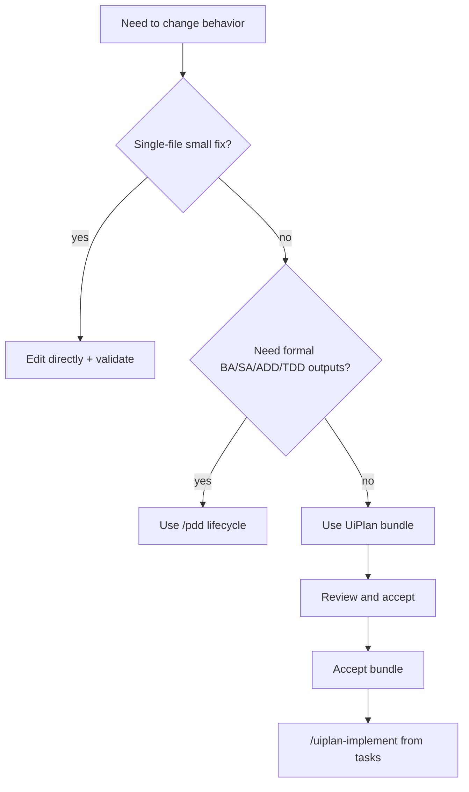
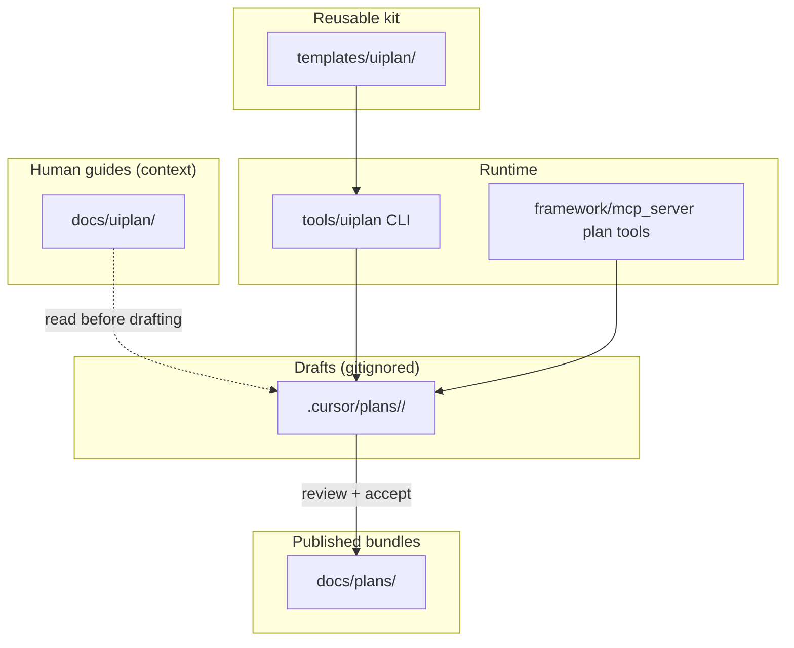
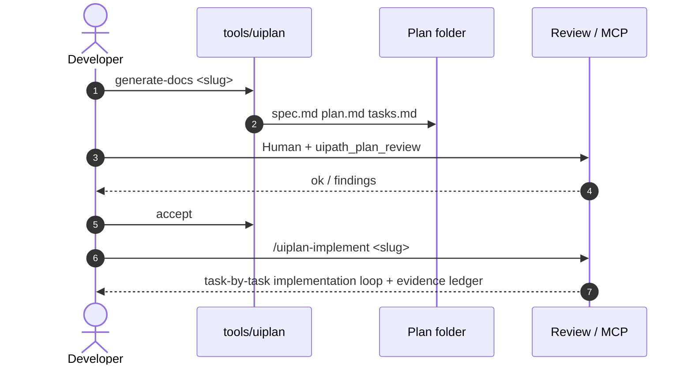

# UiPlan (spec + plan + tasks)

UiPlan is the three-file planning-to-build contract used before implementation:
`spec.md` (what), `plan.md` (how), and `tasks.md` (executable steps + evidence).
It supports Cursor slash commands, MCP tool calls, and terminal usage.

**Canonical procedures** (command matrix, paths, lifecycle, lessons, review fixes):
[HOW_TO_USE.md](HOW_TO_USE.md). Use that file for **how** to run each surface; this
README explains **what** UiPlan is and **when** to use it.

## Choose your path

Use one primary path per session; all paths converge on the same bundle and gates.

| Path | Use this when | Primary commands |
| --- | --- | --- |
| Cursor chat | Interactive planning in IDE | `/uiplan-full` or staged `/uiplan-ground` -> `/uiplan-spec` -> `/uiplan-plan` -> `/uiplan-tasks` -> `/uiplan-review` -> `/uiplan-implement` |
| Terminal CLI | Scriptable/headless flow | `uipath-claude plan uiplan full` or staged `ground/spec/plan/tasks/review` |
| MCP tools | Agent/tool-driven orchestration | `uipath_plan_ground`, `uipath_plan_spec_new`, `uipath_plan_plan_new`, `uipath_plan_tasks_new`, `uipath_plan_review`, `uipath_plan_accept` |
| **UiPlan Studio Explorer** | Visual project map (UI/API/Agent/RPA/Maestro/App/Orchestrator/Test) with BA overview, drill-down, knowledge tab | `uipath-claude explore` — see [EXPLORER.md](EXPLORER.md). To adopt in a new project: [EXPLORER_NEW_PROJECT.md](EXPLORER_NEW_PROJECT.md) |

## Quickstart (5 steps)

1. Generate or refresh a draft bundle under `.cursor/plans/<slug>/`.
2. Fill and tighten `spec.md`, `plan.md`, and `tasks.md` (remove placeholders).
3. Run review (`uipath_plan_review` or `/uiplan-review <slug>`) until no error findings remain.
4. Accept the bundle (`uipath_plan_accept`) after human approval.
5. Implement from accepted tasks (`/uiplan-implement <slug>`), then publish when needed.

## When to use UiPlan vs skip it

Use UiPlan when:
- a change touches multiple artifacts/surfaces (`.xaml`, `.flow`, agent `.py`, `.dmn`, bindings/resources);
- there are architecture or sequencing decisions to lock before coding;
- you need traceable review gates and evidence-driven implementation.

Skip UiPlan (direct edit + validate) when:
- the change is a tiny single-file fix with no routing/contract impact;
- there is no meaningful design tradeoff and no cross-surface dependency.

## Role-based read order

- BA/PM: this file -> [HOW_TO_USE.md](HOW_TO_USE.md)
- Solution Engineer: [HOW_TO_USE.md](HOW_TO_USE.md)
- Implementer: [TASK_AUTHORING.md](TASK_AUTHORING.md)
- Template maintainer: [../../templates/uiplan/README.md](../../templates/uiplan/README.md)
- Repo hygiene / sample folders: [CLEANUP_CLASSIFICATION.md](CLEANUP_CLASSIFICATION.md)
- Evaluation rubric scope (deterministic vs LLM): [_internal/RUBRIC_POLICY.md](_internal/RUBRIC_POLICY.md)

## 360 visibility standard (2026 update)

UiPlan now enforces a 360 build-visibility contract across the bundle:

- `spec.md` is the BA / Developer scope contract and must include
  `## 360 Build Visibility Contract` (workflow/artifact inventory,
  dependencies/connectors, surface boundaries, logging/observability,
  scaffold provenance, and verification evidence expectations).
- `plan.md` is the Solution Engineer blueprint and must mirror the spec
  visibility rows in concrete inventories: workflow catalog, activity/dependency
  matrix, connector/resource inventory, invocation boundaries, and logging
  contract.
- `tasks.md` is the executable build sheet and must map every in-scope artifact
  to task IDs, commands, evidence paths, and per-workflow internal diagrams.
- Template contract now also requires per-workflow activity conformance:
  each workflow row must declare mandatory activities/nodes, skill/tool route,
  and a verification gate proving those activities are truly present.
- UiPlan is visual-first by standard. New bundles must include a business
  process flow, solution architecture, runtime sequence, decision tree,
  workflow-internal visuals, and an evidence coverage map at the appropriate
  stage. Visuals are build contracts, not illustrations.
- `uipath_plan_review` is the hard gate: under-specified bundles fail before
  acceptance.
- `/uiplan-implement` runs a preflight and refuses thin accepted bundles before
  source edits (accepted status does not bypass quality gates).

Recent lessons are now part of the default contract: named-template provenance
for every Studio/repo template, the `copy/export -> read/inspect -> preserve ->
customize in place -> verify` host-shell lifecycle, dispatcher-template
provenance for mailbox intake, long-running AnalyzerRunner and HITL template
customization, real connector-read evidence, per-workflow diagram + activity
checklist coverage, richer cross-surface visuals, and Studio-visible
correlation/log assertions.
Capture additional durable retrospectives through the
[library learning loop](../LIBRARY_LEARNING.md) so transcript-derived lessons
can be reviewed, approved, and reused across future bundles.

Use `--paradigm` to override detection when needed (for example, forcing
`coded-agent` or `solution` in mixed repositories).

## Decision tree (when to use UiPlan)

## Audience

- **Humans** authoring or reviewing build-ready specs in Cursor or on GitHub.
- **Agents** using `uipath_plan_*` tools and the [UiPlan Cursor skill](../../.cursor/skills/uiplan/SKILL.md).

## Where to start

| Doc | Purpose |
| --- | --- |
| [HOW_TO_USE.md](HOW_TO_USE.md) | MCP vs CLI vs skill; folder conventions; approval gate |
| [TASK_AUTHORING.md](TASK_AUTHORING.md) | Workflow design, capability routing, task examples, and implementation loop |
| [STUDIO.md](STUDIO.md) | Local visual builder workflow, canvas persistence, Copilot runtime, and preview/apply generation |
| [UiPlan framework historical plan](../plans/2026-04-21-uiplan-framework.md) | Historical design record; not the current operating guide |
| [Template kit](../../templates/uiplan/) | `_spec-template.md`, `_plan-template.md`, `_tasks-template.md`, `_diagram-patterns.md` |
| [Orchestrator deployment runbook](../ORCHESTRATOR_DEPLOYMENT.md) | Optional deploy gates and compatibility preflight for generated tasks |
| [Mermaid Pro Standard](../../.cursor/skills/mermaid-diagram-builder/SKILL.md) | Diagram style contract for this repo |
| [MERMAID_VALIDATION.md](MERMAID_VALIDATION.md) | Optional `mmdc` batch check for fenced diagrams |
| [SCAFFOLD_CODE.md](SCAFFOLD_CODE.md) | What `tools.uiplan scaffold-code` does today |
| [../CAPABILITY_CONTRACT.md](../CAPABILITY_CONTRACT.md) | Canonical CLI/Cursor/MCP surface and non-goals |

## Authority map

| Surface | Canonical location | Role |
| --- | --- | --- |
| UiPlan document templates | [`templates/uiplan/`](../../templates/uiplan/) | Source for generated `spec.md`, `plan.md`, `tasks.md`, and diagram snippets |
| Human documentation | [`docs/uiplan/`](./) | Current operating guide for humans and agents |
| Cursor skill behavior | [`../../.cursor/skills/uiplan*/`](../../.cursor/skills/) | Slash command behavior and planning/implement contracts |
| MCP tool implementation | [`../../framework/mcp_server/tools/plan_uiplan.py`](../../framework/mcp_server/tools/plan_uiplan.py), [`../../framework/mcp_server/tools/plan_uiplan_review.py`](../../framework/mcp_server/tools/plan_uiplan_review.py) | Generation, review, accept/publish surfaces |
| Local CLI/runtime | [`../../tools/uiplan/`](../../tools/uiplan/) | `generate-docs`, `scaffold-code`, validation helpers, and adapters |
| Draft bundles | `.cursor/plans/<YYYY-MM-DD-slug>/` | Per-user working drafts with `.meta.yaml` |
| Published bundles | [`../plans/`](../plans/) | Git-tracked accepted plans after publish |

`scaffold-code` is not the primary implementation command. Treat it as local
runtime/adaptor support; `/uiplan-implement` is the review-first build handoff.

## Review and implement gates

Before any implementation begins:

1. `uipath_plan_review(stage=all)` must pass without error-severity findings.
2. `.meta.yaml` status must be `accepted`.
3. The bundle must pass 360 completeness checks (no template residue, no missing
   artifact chain, no missing connector inventory, no missing boundary/logging
   contract, no stub-only XAML tasks, and no missing per-workflow diagrams).

## Repository layout (UiPlan-related)

## Generate → review → accept → implement (sequence)

## Best leverage patterns

| Pattern | Use UiPlan this way | Expected benefit |
| --- | --- | --- |
| Small feature | Keep spec short, focus plan on integration points, split 3-6 tasks | Fast implementation with low overhead |
| Medium refactor | Expand risks/rollback in plan, enforce task-level validation checks | Lower regression risk |
| Formal initiative | Use UiPlan for build contract, then handoff to `/pdd` for full lifecycle docs | Better cross-team coordination |
