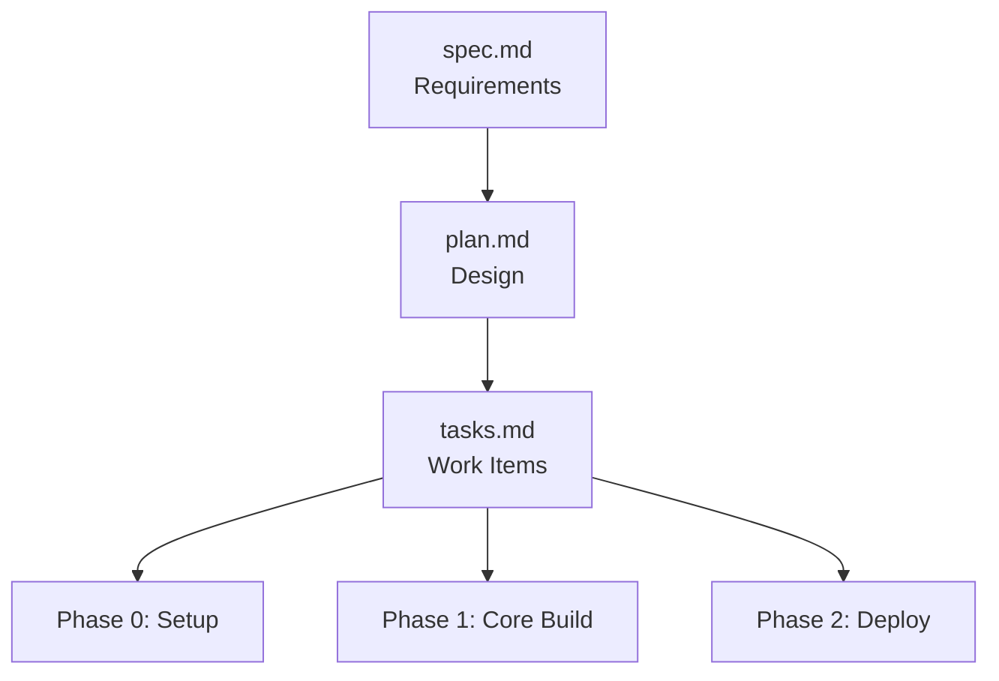

# Example UiPlan Project Plan

## Decisions

- **File structure**: Use the canonical three-file layout (spec, plan, tasks) in a single directory
- **Metadata format**: YAML front matter with `name` and `overview` keys minimum
- **Task organization**: Group by phase (Phase 0, Phase 1, etc.) with clear phase goals
- **Visualization**: Design for both linear task lists and flow diagrams in UiPlan Studio

## Architecture



### Components

1. **spec.md**: Contains problem context, requirements, constraints, success criteria
2. **plan.md**: Contains decisions, architecture diagrams, component descriptions, rationale
3. **tasks.md**: Contains actionable work items with checkboxes, organized by phase

### Data Flow

1. User creates a new UiPlan bundle by adding `spec.md`, `plan.md`, and `tasks.md` to a folder
2. UiPlan Studio Explorer scans configured paths for bundles
3. Studio displays bundles in the left rail with progress indicators
4. User selects a bundle to view detailed task flow and phase structure

## Implementation Notes

### Front Matter Requirements

All three files must start with YAML front matter:

```yaml
---
name: Project Name
overview: "One-sentence summary"
---
```

### Task Format

Tasks in `tasks.md` must use standard Markdown checkboxes:

```markdown
## Phase 0: Setup

- [ ] Pending task
- [x] Completed task
```

### Discoverability

The UiPlan Studio backend scans these locations by default:

- Repository root
- `.cursor/plans/*/`
- `docs/superpowers/plans/*/`
- Any nested `*/spec.md` with sibling `plan.md` and `tasks.md`

## Rationale

The three-file structure provides:

- **Separation of concerns**: Spec (what), Plan (how), Tasks (when)
- **Progressive disclosure**: Read spec first, drill into plan, track tasks
- **Machine readability**: Structured format for tooling and visualization
- **Human readability**: Standard Markdown for easy editing

## Alternatives Considered

- Single mega-document: Rejected due to poor progressive disclosure
- JSON/YAML only: Rejected due to poor human readability
- Wiki-style pages: Rejected due to lack of version control integration
