# UiPlan diagram patterns (Pro Standard)

Copy one of the blocks below into `spec.md`, `plan.md`, or `tasks.md`, then **replace labels only**. Full rules: [`.cursor/skills/mermaid-diagram-builder/SKILL.md`](../../.cursor/skills/mermaid-diagram-builder/SKILL.md).

## Diagram accessibility checklist

- Use descriptive node labels; do not rely on color to encode meaning.
- Keep left-to-right or top-to-bottom direction consistent within a diagram.
- Keep edge labels concise and explicit for branch meaning.
- Prefer fewer nodes with clearer names over dense micro-steps.
- Ensure every diagram has a clear start and end state.

## When to use which

| Pattern | Use for |
| --- | --- |
| **Flowchart TB** | Layered architecture, scope boundaries, gate pipelines |
| **Sequence** | Actor vs system vs HITL message flow |
| **State** | Plan lifecycle (draft -> review -> accepted) |
| **Story workflow map** | Per-story execution narrative for spec/plan/tasks |
| **Task dependency map** | Task ordering and parallel tracks in tasks |
| **Queue/data contract map** | Queue, asset, and output boundaries |
| **Capability ownership map** | BA/SA/Dev/QA + skill responsibility split |
| **Build loop** | Restore -> analyze -> test -> pack loop with retry |
| **HITL review sequence** | Review creation, human decision, closure updates |

## Required visual set by UiPlan stage

UiPlan documents are visual-first by default. Use diagrams to make hidden
handoffs, ownership, and verification gates obvious before implementation.

| Visual | Required in | Purpose |
| --- | --- | --- |
| Business process flow | `spec.md` | Stakeholder-readable story and outcome path |
| Solution architecture | `spec.md`, `plan.md` | Artifact, system, queue/asset, connector, and boundary map |
| Runtime sequence | `plan.md` | Handoff timing and input/output contracts |
| Decision tree | `spec.md`, `plan.md` | Branch ownership, human-review triggers, exception paths |
| Workflow internals | `plan.md`, `tasks.md` | One internal-step diagram per executable `.xaml`, `.flow`, `.py` graph, or `.dmn` |
| Evidence map | `tasks.md` | Command -> gate -> output path -> review/acceptance loop |

---

## 1) Flowchart TB (layered scope)

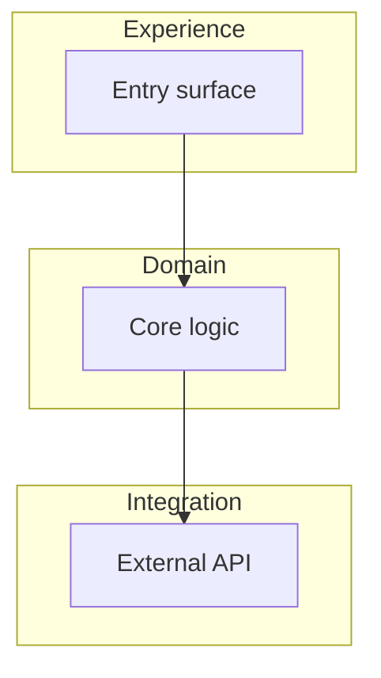

---

## 2) Sequence (actors vs system)

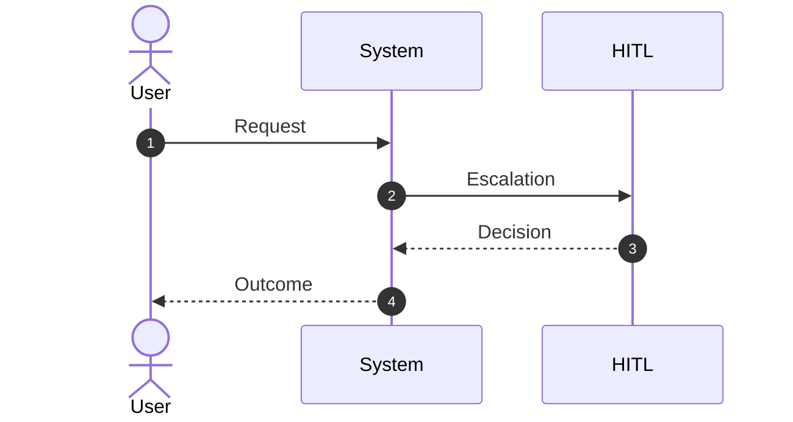

---

## 3) State diagram (plan lifecycle)

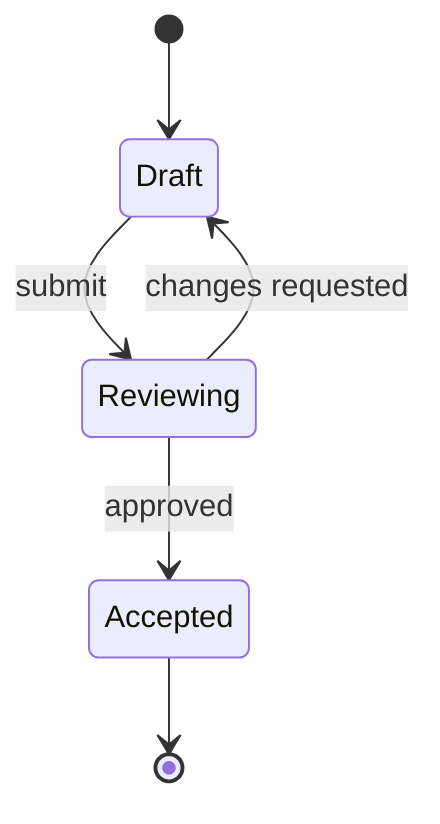

---

## 4) Story workflow map

Use in `spec.md`, `plan.md`, and `tasks.md` when you need one diagram per story.

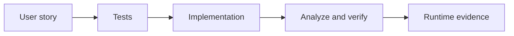

---

## 5) Task dependency map

Use in `tasks.md` to show execution order and parallel lanes.

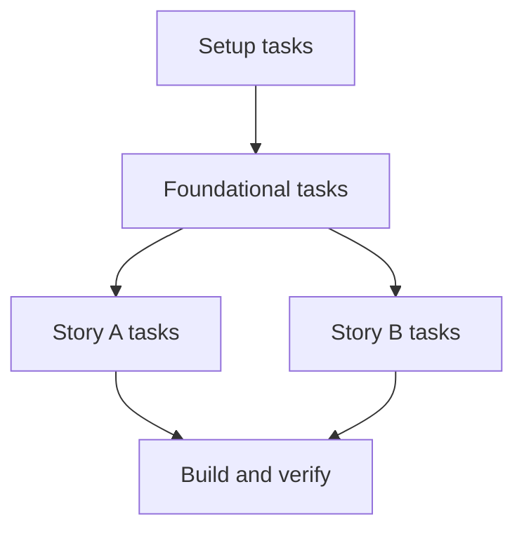

---

## 6) Queue/data contract map

Use in `spec.md` and `plan.md` to explain queue, asset, and output contracts.

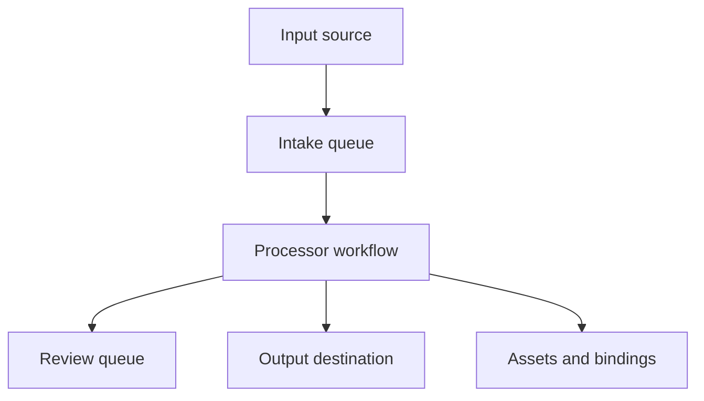

---

## 7) Capability ownership map

Use in `plan.md` and `tasks.md` to show who owns each part of implementation.

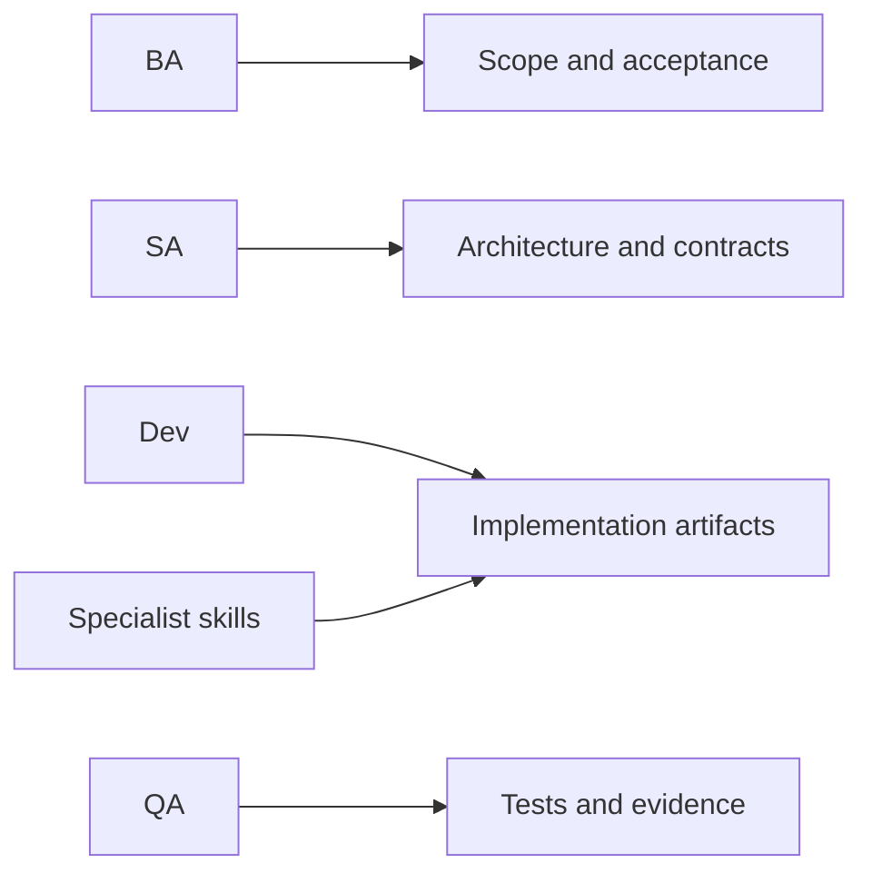

---

## 8) Build/analyze/test/pack loop

Use in `plan.md` and `tasks.md` build/handoff sections.

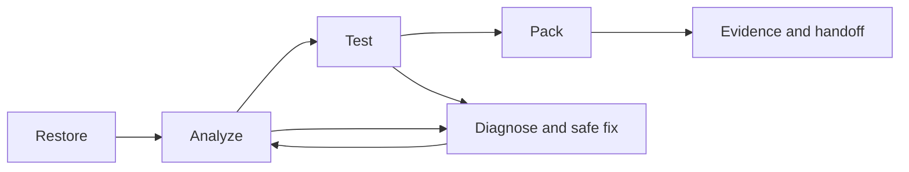

---

## 9) HITL review sequence

Use in `spec.md` and `tasks.md` where human-review logic is required.

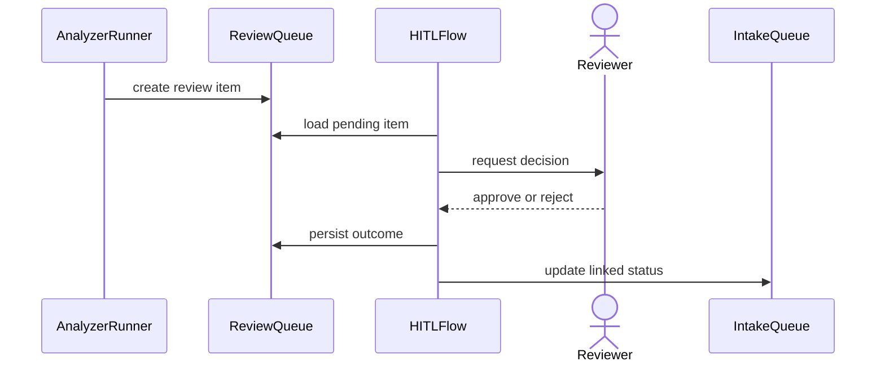

---

## 10) Solution architecture

Use in `spec.md` and `plan.md` when a solution spans workflows, agents, flows,
queues/assets, connectors, and external systems.

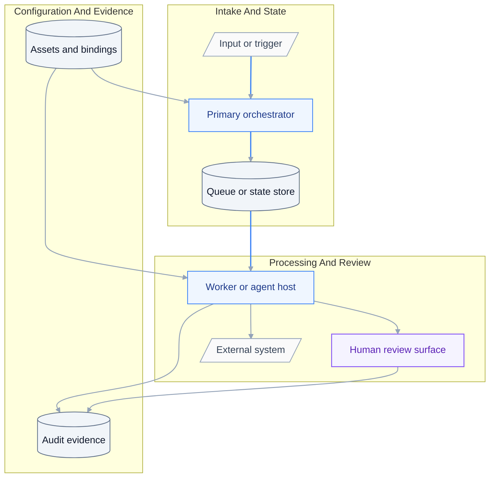

---

## 11) Decision tree

Use in `spec.md` and `plan.md` for business routing, policy ownership, and
human-review or exception boundaries.

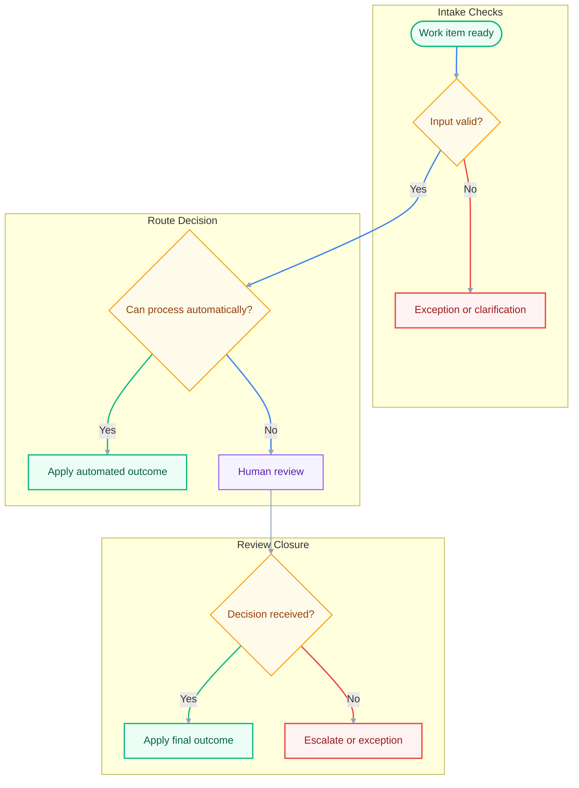

---

## 12) Evidence coverage map

Use in `tasks.md` and review reports to prove each planned surface has a command,
gate, output path, and rerun loop.

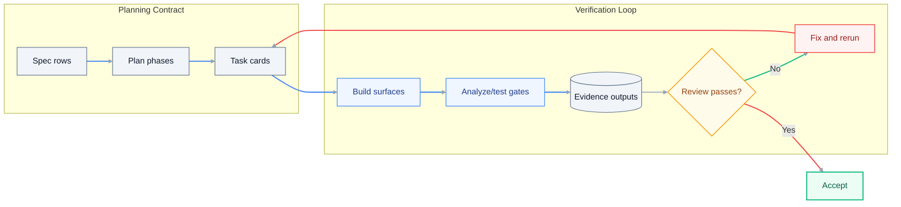
