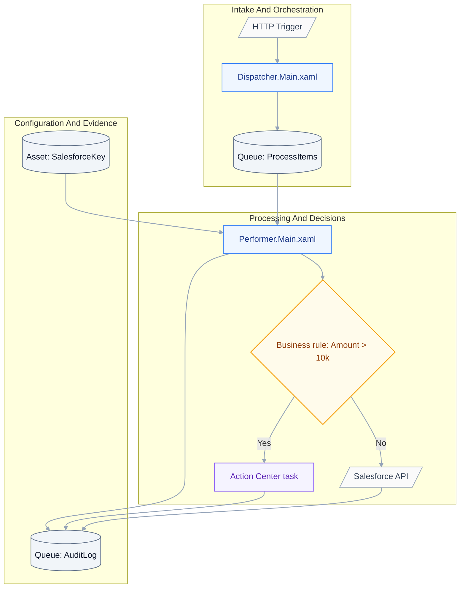
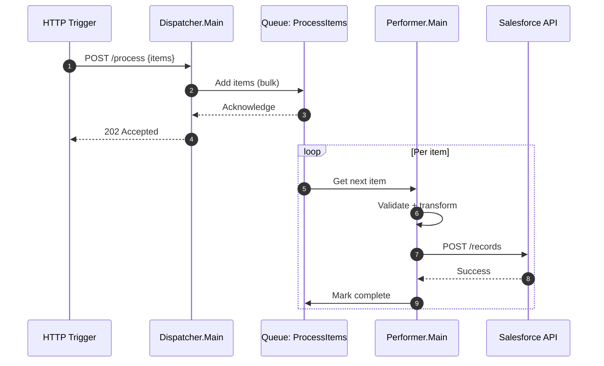
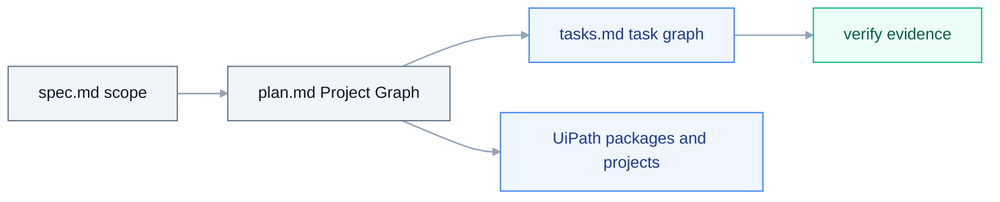
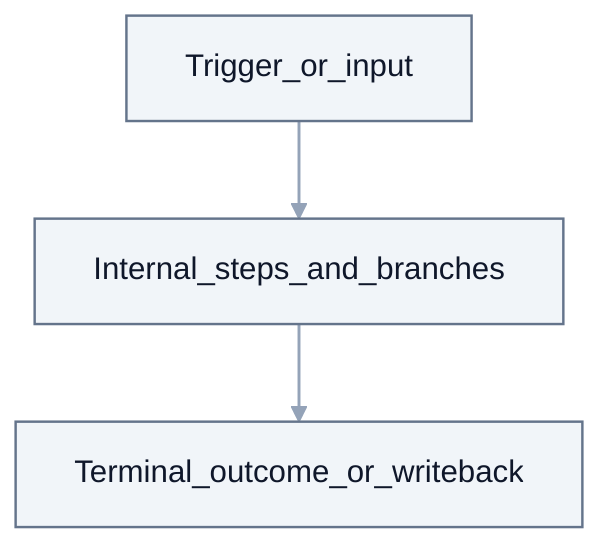
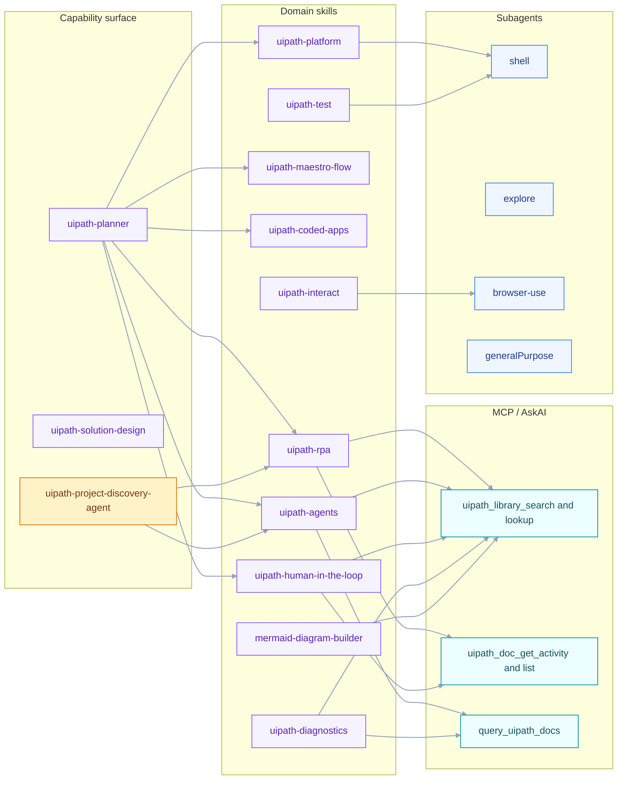
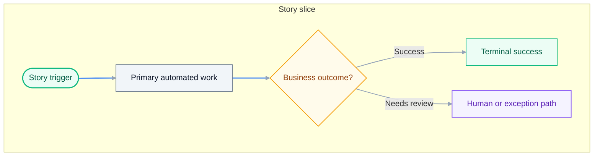
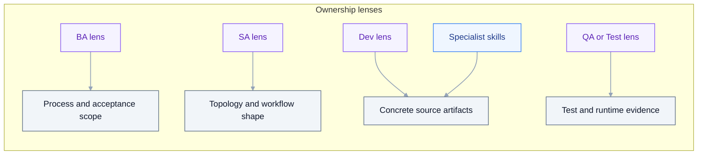
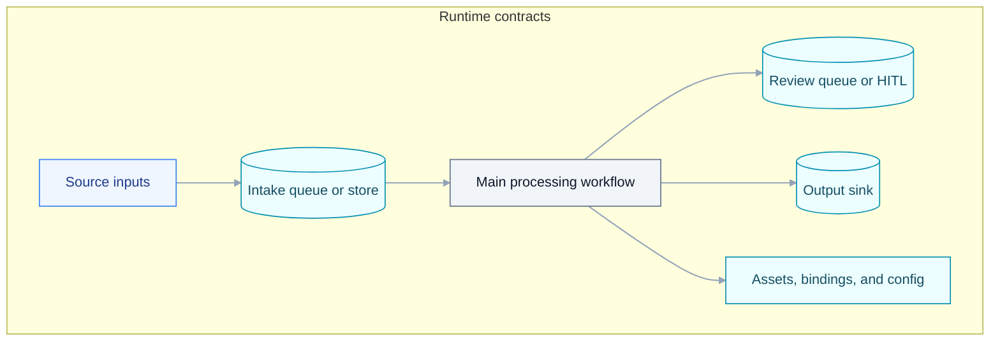
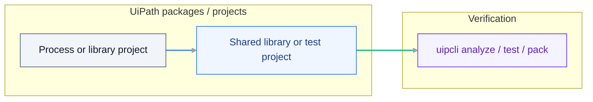
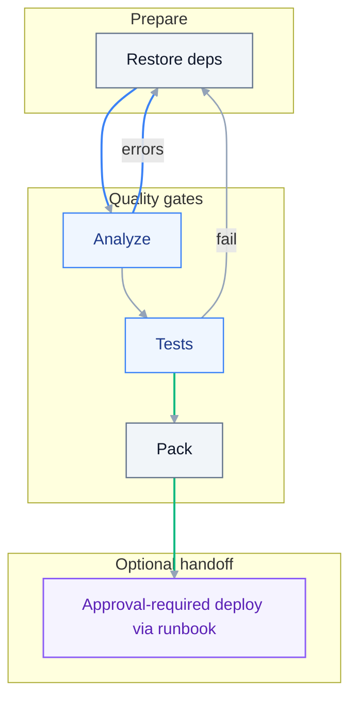

# Implementation Plan: {{TITLE}}

> **Grounding:** {{GROUNDING_CITATIONS}}
> **Spec:** `./spec.md`

**Date**: {{DATE}}
**Spec**: ./spec.md

## Quick start (from accepted spec to executable plan)

1. Fill `## Summary` with scope, constraints, and target outcome.
2. Fill `## Project Inventory` and `## Workflow Catalog` with real artifact paths.
3. Fill `## Skill and Subagent Routing` so execution ownership is explicit.
4. Fill `## CLI Command Matrix` with concrete verify commands and evidence paths.
5. Fill `## Open Grounding Questions` only for unresolved blockers.

## Accessibility and usability checklist

- Keep architecture explanations in plain language before technical detail.
- Keep each table column name explicit and unambiguous.
- Ensure every workflow listed has a matching diagram section.
- Use consistent naming for projects, workflows, and resources across sections.
- Prefer concise, actionable instructions over narrative paragraphs.

## Audience and Scope

This document is the **Developer <-> Solution Engineer** contract. It captures
architecture, paradigm decisions, project topology, integration boundaries,
bindings, dependencies, capability routing, and build/verify gates.

- **Do** name projects, workflow files, workflow types, queues, assets, code
  modules, dependencies, CLI families, skills, subagents, and agents.
- **Do** declare the stack policy and any coded-surface justification.
- **Do not** expand into per-activity micro-instructions or per-line CLI
  recipes — that elaboration belongs in `tasks.md`.

If a role hits a knowledge gap, run the AskAI / Library ladder before asking
the user: `uipath_library_search` / `uipath_library_lookup` ->
`uipath_doc_get_activity` / `uipath_doc_list_packages` -> `query_uipath_docs` ->
specialist skill or `[agent:uipath-project-discovery-agent]`, then user.

## Stack Policy (Modern Studio + Activity-First)

- **Studio**: latest UiPath Studio + Studio Web. **No Legacy / Windows-Legacy /
  VB.Net / Classic.** `uipath-rpa-legacy` is excluded from default routing.
- **Expressions / runtime**: C# expressions, Windows target, .NET 8.
- **Activity-first**: prefer `.xaml` workflows built from UiPath activities
  (resolved via `uipath_doc_get_activity`). Coded automation (`.cs`) is allowed
  only when explicitly justified in `## Coded Surface Justification` below.
- **Coded agents** (Python / LangGraph default) remain unaffected; this policy
  is RPA-side only.

### Coded Surface Justification

| Coded surface (`.cs` workflow) | Why activities are insufficient | Coverage check (library / activity-doc lookup) |
| --- | --- | --- |
| _empty by default — fill only when justified_ | | |

## Summary

{{SUMMARY}}

## Per-project workflow and platform inventory

Fill after solution/RPA decomposition (names come from SDD/plan — not invented):

| Project / package | Entry workflows (`.xaml` / `.cs` / graph) | Queues / assets / bindings |
| --- | --- | --- |
| _e.g. `projects/ZipEmail.Dispatcher/Main.xaml`_ | Sequence / Flowchart / Long Running + named sequences | _Queue names, asset keys, `bindings/dev.json` keys_ |

List open **AskAI / library** topics (`uipath_library_search` query text) and mandatory `uipath_doc_get_activity` calls before implementation.

## 360 visibility traceability (spec -> plan)

Each row must map to one or more rows in `spec.md` `## 360 Build Visibility Contract`.
Do not leave rows out for in-scope surfaces.

| Spec visibility area | Plan section(s) carrying it | Required plan evidence |
| --- | --- | --- |
| Workflow/artifact inventory | `## Workflow Catalog`, `## Project Inventory` | every artifact has path/type/owner |
| Activity/connector/dependency visibility | `## Activity Inventory`, `## Dependency Matrix` | package/activity/connector rows resolved from docs |
| Agent/DMN/Flow/HITL/platform resources | `## Code Module Inventory`, `## Bindings and Environment` | invocation boundaries + IO + ownership |
| Logging/observability contract | `## Logging and verification contract` | phase markers + correlation id + assertions |
| Scaffold provenance and anti-stub rules | `## Project Inventory`, `## Workflow Catalog` | scaffold source + preserved structure + anti-stub notes |
| Verification/evidence contract | `## CLI Command Matrix` | per-surface verify commands + evidence outputs |

## Spec artifact chain map

Each in-scope artifact from `spec.md` must be traceable through plan design and
task execution.

| Spec artifact path | Plan section owning design | Planned task area | Verify/evidence owner |
| --- | --- | --- | --- |
| `<artifact path>` | `## Workflow Catalog` / `## Activity Inventory` | `tasks.md` story + task IDs | `## CLI Command Matrix` |

## Project Graph

The project graph is the machine-readable planning spine for visual generation,
task authoring, and package mapping. Keep node IDs stable across this section,
`## Workflow Catalog`, `## Skill and Subagent Routing`, and `tasks.md`.

### Solution architecture

This mirrors the `spec.md` architecture but adds concrete project/file names and bindings.



### Runtime sequence

This shows the message/data handoff timing between components at runtime.



### Workflow catalog

List all workflows/flows/agents with their internal structure and entry points.

| Workflow | Type | Entry point | Internal steps | Dependencies |
| --- | --- | --- | --- | --- |
| `Dispatcher.Main.xaml` | Sequence | HTTP trigger | 1. Load config, 2. Validate input, 3. Bulk add to queue | Queue: ProcessItems, Asset: ConfigPath |
| `Performer.Main.xaml` | Long Running | Queue trigger | 1. Get item, 2. Validate, 3. Business rule, 4. Call Salesforce, 5. Log result | Queue: ProcessItems, Asset: SalesforceKey, Integration: Salesforce |

### Mermaid source blocks

Add one Mermaid block per graph view needed by the bundle. Use these source
blocks as the canonical visual inputs for Studio planning views, task dependency
visuals, and package topology.



### Task/todo source list

List the source tasks that should become graph nodes or edges. Use task IDs from
`tasks.md` once generated; before task generation, use stable planned IDs or story
labels that can be replaced during authoring.

```text
- US1 -> T010 test/evidence node -> T011 implementation node -> T030 verify node
- US2 -> T020 test/evidence node -> T021 implementation node -> T031 verify node
```

### Context source table

| Context source | Graph node(s) informed | Evidence / citation |
| --- | --- | --- |
| `spec.md` `## 360 Build Visibility Contract` | scope, artifact, evidence nodes | spec row IDs / acceptance criteria |
| `## Grounding Inputs` | skill, library, activity-doc nodes | `[skill:...]`, library hits, activity docs |
| `## Project Inventory` / `## Workflow Catalog` | package/project/workflow nodes | artifact paths and entrypoints |
| `## Bindings and Environment` | queue, asset, connection, binding nodes | provisioning and verification paths |

### Generation stages

| Stage | Inputs | Outputs | Gate before next stage |
| --- | --- | --- | --- |
| Scope graph | `spec.md` stories, artifacts, acceptance criteria | story/artifact nodes | every in-scope artifact has an owner |
| Design graph | project inventory, workflow catalog, bindings | project/workflow/resource nodes and edges | no unresolved grounding for required activities/resources |
| Task graph | planned story slices, verify gates | task/todo nodes and dependencies | every task maps to artifact + command + evidence |
| Package graph | project graph, dependency matrix, CLI matrix | graph-to-package rows | restore/analyze/test/pack commands are declared |

### Graph-to-package mapping

Map every graph node that produces code, workflow, config, or deployable output
to its owning package/project and verification evidence.

| Graph node / edge | Owning package/project | Artifact path | Build task IDs | Verify evidence |
| --- | --- | --- | --- | --- |
| `Workflow:<Name>.Main` | `<Package.Name>` | `projects/<Name>/Main.xaml` | `T0xx` | `out/<name>-analyze.json` |
| `Agent:<Name>.Graph` | `<Agent.Package>` | `projects/<Agent>/langgraph.json`, `projects/<Agent>/main.py` | `T0xx` | `pytest`, `uipath run`, eval output |
| `Resource:<QueueOrAsset>` | Solution / platform config | `bindings/dev.json` or environment record | `T0xx` | provision + verify JSON |

## Grounding Inputs

{{GROUNDING_CONTEXT}}

## Source routing (MCP)

{{SOURCE_ROUTING_SNIPPET}}

## Planner Route & Specialist Handoff

{{PLANNER_HANDOFF}}

## Project Inventory

Every project in scope, its kind, descriptor, starter template, and scaffold command.
When `spec.md` names a template-backed surface (for example Dispatcher,
Performer, Long Running Workflow, Flow HITL, or coded-agent scaffold), the plan
must name that exact starter template and preserve its intended runtime shape.
Do not replace a named template with a blank project scaffold unless `plan.md`
records the reason and the equivalent runtime behavior.

| Project | Kind | Repo path | Descriptor | Starter template | Scaffold command |
| --- | --- | --- | --- | --- | --- |
| _e.g. `Process.Dispatcher`_ | modern-rpa | `projects/Process.Dispatcher/` | `project.json` | Dispatcher | `uip rpa create-project --studio-dir ...` |

## Workflow Catalog

Per project, list every workflow file the build needs. Reference reusable patterns in
[`_workflow-catalog.md`](../../templates/uiplan/_workflow-catalog.md).

| Project | Workflow file | Type | Owns story | Invoked by | Invokes | Correlation id |
| --- | --- | --- | --- | --- | --- | --- |
| _Process.Dispatcher_ | `Main.xaml` | Sequence | US1 | Trigger | Queue.Add | `correlationId` |

Add one row for every in-scope artifact from `spec.md` (including `.flow`, `.dmn`,
`langgraph.json` entrypoints, bindings, and queue/asset sidecars when they are
part of completion criteria).

## Workflow diagram + activity conformance matrix (required)

For every workflow row in `## Workflow Catalog`, record where its diagram lives
and which activities/nodes must exist before implementation is considered done.

| Workflow artifact | Diagram section | Mandatory activities/nodes | Verify activity docs/package | Primary skill/tool route | Build/verify command |
| --- | --- | --- | --- | --- | --- |
| `projects/<Name>/Main.xaml` | `## Surface execution visuals` | Sequence, Switch, If, Assign, Log Message, Try Catch | `uipath_doc_get_activity` + package source | `[skill:uipath-rpa]` | `uipcli package analyze ... --resultPath out/analyze-<name>.json` |

## Surface execution visuals (required)

For each workflow artifact listed in `## Workflow Catalog`, add one dedicated
subsection and Mermaid diagram.

#### `projects/<Name>/Main.xaml`



Repeat this pattern for every `.xaml`, `.flow`, workflow `.py`, and `.dmn`
artifact referenced by this plan.

If a workflow artifact uses a named Studio/repo template, add explicit rows for
that template surface and include:

- scaffold/template provenance (repo template root, Studio template name, or
  existing project source),
- physical copy/export requirement: name the exact source folder or Studio
  export and the target folder that will receive it before customization,
- copied-template inspection requirement: after copy/export, read the copied
  project's workflows, config, arguments, variables, dependencies, and extension
  points before customization,
- host-shell role: state explicitly that the copied template hosts the actual
  business process and still requires business-specific workflow customization
  and smoke evidence,
- copied structure and generated control flow that must remain intact unless the
  accepted plan records an approved equivalent,
- customization points inside the copied shell, not standalone replacement
  workflows,
- verification evidence for the customized shell, not merely the copied
  baseline.

For mailbox-driven intake, include dispatcher-specific rows for copied
structure (`Data/`, `Framework/`, `Logical/`, `Templates/`, `Main.xaml`,
`Process.xaml`, queue push workflow), real connector read activity boundary
(safe sample allowed), idempotency/cursor behavior, and non-stub queue payload
evidence.

For AnalyzerRunner / Long Running Workflow surfaces, include rows for queue item
acquisition, wait/resume or persistence behavior, coded-agent invocation
boundary, response mapping, status transitions, and correlation-aware logging.

For HumanReview / HITL surfaces, include rows for the copied HITL template
source, review schema, allowed outcomes, timeout/escalation behavior, return
path, downstream queue/process update, and completed/cancelled/timeout evidence.

## Activity Inventory

Only entries resolved via `uipath_doc_get_activity` / `uipath_library_search` /
`uipath_library_lookup`. Unresolved entries belong in `## Open Grounding Questions`.

Every non-trivial activity (beyond basic `Sequence`, `Flowchart`, `If`, `Assign`,
`Log Message`, `Try Catch`) must include package ID, version, required scope,
required properties, and default XAML or Studio-generated evidence. See
[ACTIVITY_AND_RUNTIME_EVIDENCE.md](../../docs/uiplan/ACTIVITY_AND_RUNTIME_EVIDENCE.md)
§Activity selection grounding for the complete contract.

| Workflow | Package | Activity | Version | Required Scope | Inputs | Outputs | Default XAML / Evidence |
| --- | --- | --- | --- | --- | --- | --- | --- |
| _Main.xaml_ | _UiPath.Mail.Activities_ | _GetIMAPMailMessages_ | _1.23.11_ | _Use Outlook 365_ | _server, port, filter_ | _List<MailMessage>_ | `uip rpa get-default-activity-xaml` output or Studio scaffold |

## Code Module Inventory (agents / apps)

| Module | File | Symbol | Schema (request -> response) | Tools / nodes | Model / gateway |
| --- | --- | --- | --- | --- | --- |
| _AnalyzerAgent_ | `projects/AnalyzerAgent/src/graph.py` | `graph` | `{ subject, body } -> { route, reasons }` | classify, lookup_vendor | UiPath LLM Gateway / gpt-4o-mini |

## Bindings and Environment

Every Orchestrator resource (queue, asset, folder, connection, binding) must be
explicitly declared with provisioning commands, verification commands, and evidence
paths. See [ACTIVITY_AND_RUNTIME_EVIDENCE.md](../../docs/uiplan/ACTIVITY_AND_RUNTIME_EVIDENCE.md)
§Orchestrator resource lifecycle for the complete contract.

### Queues

| Name | Target Folder | Environment | Provisioning Command | Verification Command | Evidence Path | Notes |
| --- | --- | --- | --- | --- | --- | --- |
| _IntakeQueue_ | _Shared/Dev_ | dev | `uip or queues create --name IntakeQueue --folder-id <id> --output json` | `uip or queues list --filter "name eq 'IntakeQueue'" --output json` | `out/queue-create.json`, `out/queue-verify.json` | _stores intake items_ |

### Assets

| Name | Type | Target Folder | Environment | Secret Boundary | Provisioning Command | Verification Command | Evidence Path | Notes |
| --- | --- | --- | --- | --- | --- | --- | --- | --- |
| _MailConnection_ | Text (secret) | _Shared/Dev_ | dev | Credential | `[HANDOFF:Secrets]` | `uip or assets list --filter "name eq 'MailConnection'" --output json` | `out/asset-verify.json` | _credential, set per env_ |

### Folders

| Name | Parent | Target Folder ID | Environment | Provisioning Command | Verification Command | Evidence Path | Notes |
| --- | --- | --- | --- | --- | --- | --- | --- |
| _Dev_ | _Shared_ | (pre-existing) | dev | (not required if pre-existing) | `uip or folders get --id <folder-id> --output json` | `out/folder-verify.json` | _dev environment folder_ |

### Connections (Integration Service / Studio Web Connectors)

| Resource type | Name/id | Environment file | Owner surface | Provisioning / OAuth handoff | Verification evidence |
| --- | --- | --- | --- | --- | --- |
| _Connector connection_ | _connection-id_ | `bindings/dev.json` | _Flow or XAML host_ | `[HANDOFF:OAuth]` or pre-configured | _connectivity check + run log_ |

### Bindings (Solutions only)

| Binding key | Environment file | Bound resource | Target Folder | Notes |
| --- | --- | --- | --- | --- |
| _queueName_ | `bindings/dev.json` | _IntakeQueue_ | _Shared/Dev_ | Maps logical queue name to tenant queue |

## Dependency Matrix

| Project | Manager | Package | Version | Source |
| --- | --- | --- | --- | --- |
| _Process.Dispatcher_ | NuGet | _UiPath.Mail.Activities_ | _>=1.20_ | library hit |
| _AnalyzerAgent_ | uv | _uipath-langchain_ | _>=0.8,<0.9_ | pyproject |

## CLI Command Matrix

Per project, the exact commands the Solution Engineer runs in the build loop.

**Local validation** (required before pack/deploy):
- `uip rpa get-errors --file-path <workflow>.xaml --project-dir <project-root> --output json`
- `uip rpa build <project-root> --output json`
- `uipcli package analyze <project-root>/project.json --resultPath out/<name>-analyze.json`

**Package validation** (required before deploy):
- `uipcli package pack <project-root> -o out`

**Tenant deploy/smoke** (required for production-bound stories, or record structured blocker):
- Deploy to non-Production folder (personal workspace, Dev, or Test)
- Start job with safe fixture input
- Read job logs and assert expected markers
- Verify queue items / asset values (when applicable)

**UAT/test-case validation** (required for production-bound stories):
- Automated tests: `uipcli test run -a <projectKey> <project-root>` (RPA), `uv run pytest tests/ -q` (agents), `uipath eval --eval-set <set>` (agent evals)
- Manual UAT: documented scenario, observed outcomes, attached evidence

**Log validation** (required):
- Assert Studio-visible phase markers and correlation IDs appear in job logs

| Project | Restore | Local Validation | Analyze | Test | Pack | Tenant Deploy | Tenant Smoke | UAT/Test Evidence |
| --- | --- | --- | --- | --- | --- | --- | --- | --- |
| _Process.Dispatcher_ | `uipcli package restore` | `uip rpa get-errors`, `uip rpa build` | `uipcli package analyze --resultPath out/dispatcher-analyze.json` | `uipcli test run -a <key> .` | `uipcli package pack` | `uipcli package deploy --folder Shared/Dev` | `uip or jobs start --process-key <key> ...`, `uip or jobs logs --job-id <id>` | `uipcli test run` results + AC mapping |

## Skill and Subagent Routing

Map every project x phase to the owning capability. Each row also informs
`tasks.md` task tags.

| Project | Phase | Skill(s) | Agent / discovery | Subagent | MCP / AskAI tools |
| --- | --- | --- | --- | --- | --- |
| _Process.Dispatcher_ | Build | `[skill:uipath-rpa]` | `[agent:uipath-project-discovery-agent]` | `[subagent:explore]` | `uipath_library_search`, `uipath_doc_get_activity` |
| _AnalyzerAgent_ | Build | `[skill:uipath-agents]` |  | `[subagent:generalPurpose]` | `uipath_library_search`, `query_uipath_docs` |
| _all_ | Verify | `[skill:uipath-diagnostics]`, `[skill:uipath-platform]`, `[skill:uipath-test]` |  | `[subagent:shell]`, `[subagent:browser-use]` (UI smoke) |  |
| _all_ | Diagrams | `[skill:mermaid-diagram-builder]` |  |  |  |

## LLM execution navigation (skills/tools/subagents)

This table is a deterministic navigation contract for LLMs and implementers.

| Execution question | Section to navigate | Primary surface | Escalation path |
| --- | --- | --- | --- |
| Which artifact to build? | `## Workflow Catalog`, `## Project Inventory` | project + workflow path | `## Open Grounding Questions` |
| Which skill/tool to use? | `## Skill and Subagent Routing` | `[skill:...]`, `[subagent:...]` | `## AskAI / Library Escalation Ladder` |
| Which command verifies completion? | `## CLI Command Matrix` | restore/analyze/test/pack/smoke | `## Logging and verification contract` |
| Which evidence proves done? | `## Logging and verification contract` | expected logs/assertions | task evidence paths in `tasks.md` |

HITL routing defaults to the accepted plan's chosen template surface. If the
HITL host is an RPA/Long Running Workflow project, route through
`[skill:uipath-rpa]` plus `[skill:uipath-human-in-the-loop]`; if accepted
`spec.md` explicitly requires Flow as the HITL canvas, mark the override in this
section and route through `[skill:uipath-maestro-flow]` plus
`[skill:uipath-human-in-the-loop]` instead. In both cases, the tasks must copy or
scaffold the named HITL template, read the copied template, customize it in
place, and verify the customized review workflow.

## Capability Routing Map



## AskAI / Library Escalation Ladder

When uncertain about activities, packages, CLI flags, integration patterns, or
project context, traverse this ladder before asking the user:

1. `uipath_library_search` (ranked) and `uipath_library_lookup` (book/section).
2. `uipath_doc_get_activity` / `uipath_doc_list_packages` for activity semantics.
3. `query_uipath_docs` for AskAI fallback.
4. Specialist skill (route from the table above) or
   `[agent:uipath-project-discovery-agent]` for project-local context.
5. Only then ask the user, naming what was already attempted.

## Open Grounding Questions

Items the Solution Engineer could not auto-resolve via the ladder above. These
will surface as targeted questions when `/uiplan-plan` runs.

- _none — add `NEEDS-CLARIFICATION` items here when applicable_

## Technical Context

**Language/Version**: {{LANG_VERSION}}
**Implementation Paradigm**: {{PARADIGM}}
**CLI Family**: {{CLI_FAMILY}}
**Primary Dependencies**: {{DEPS}}
**Storage**: {{STORAGE}}
**Testing**: {{TESTING}}
**Target Platform**: {{TARGET_PLATFORM}}
**Project Type**: {{PROJECT_TYPE}}
**Performance Goals**: {{PERF}}
**Constraints**: {{CONSTRAINTS}}
**Scale/Scope**: {{SCALE}}

## XAML workflow shape (RPA / Solution)

{{WORKFLOW_SHAPE_BLOCK}}

## Story visual map

Divide visuals by user story when the spec has multiple stories. Use one
diagram per story slice so `tasks.md` can map build tasks, tests, and evidence
to the same boundaries.



## Capability and ownership map

Map each build surface to personas and specialist capabilities before tasking.



## Data and queue contract map

Show the major runtime contracts consumed by implementation tasks.



## Logging and verification contract

{{LOGGING_VERIFICATION_BLOCK}}

## Constitution Check

Gates re-checked after Phase 1 design:

{{CONSTITUTION_CHECKLIST}}

## Project Structure

### Documentation (this feature)

```text
.cursor/plans/{{FOLDER_NAME}}/
  spec.md
  plan.md
  tasks.md
  .meta.yaml
```

### Source Code (repository root)

{{CODE_STRUCTURE_BLOCK}}

### Paradigm build loop

{{BUILD_LOOP_BLOCK}}

**Structure Decision**: {{STRUCTURE_DECISION}}

## Architecture diagram

Implementation layering and dependencies for this specific plan.



## Development execution contract

The accepted bundle is the build contract. After review and human acceptance:

1. Execute `tasks.md` in order, keeping tests before implementation within each
   user-story slice.
2. Use the matched specialist skill(s) from **Grounding Inputs** for source
   changes; do not invent UiPath APIs, activities, or CLI verbs.
3. Run the local build loop for the detected project type:
   restore -> analyze -> test -> pack.
4. If analyze/test/tooling fails, parse the structured output, consult the
   relevant skills/docs/tools, apply one safe local fix when evidence supports
   it, rerun the same gate, and record the result before calling the issue
   blocked.
5. Deployment remains approval-required and follows the deployment policy below.

Preferred build handoff after review and human acceptance:

```text
/uiplan-implement {{FOLDER_NAME}}
```

`scaffold-code` is optional local runtime/adaptor support. It is not a
replacement for the implementation contract in `tasks.md`.

## Build and verify gates

Restore, analyze, test, and pack (adapt steps to your project type).



## Deployment policy

Deployment tasks are optional and approval-required. If this plan includes
publish/deploy work, reference [docs/ORCHESTRATOR_DEPLOYMENT.md](../../docs/ORCHESTRATOR_DEPLOYMENT.md)
instead of embedding long deploy recipes. The first task must be the
compatibility preflight: Studio, CLI, package versions, target framework,
Orchestrator target, and Solution/Maestro support.

## Activity references (optional)

`uipath_plan_tasks_new` scans **plan.md** and **spec.md** for machine-readable activity tags (up to 8 unique pairs) and appends matching documentation to **tasks.md**.

Tag shape on **one line** (no line breaks inside the tag): an opening square bracket `[`, the literal prefix `activity:`, your NuGet-style **PackageId**, a colon, the **ActivityName** as in Studio, then `]`. Only add tags for activities you will actually use; omit demo or placeholder tags so **Resolved activity docs** stays short.

Human-readable shape (not a tag - note the space after `[` so tooling ignores it): `[ activity:YourPackage.YourActivities:YourActivityName ]`.

## Complexity Tracking

{{COMPLEXITY_TABLE}}
