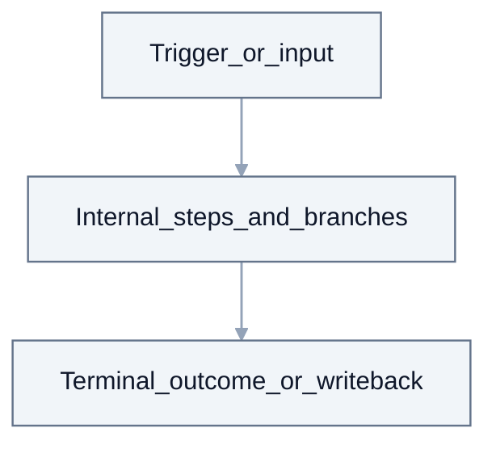
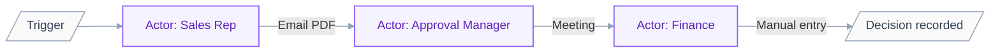
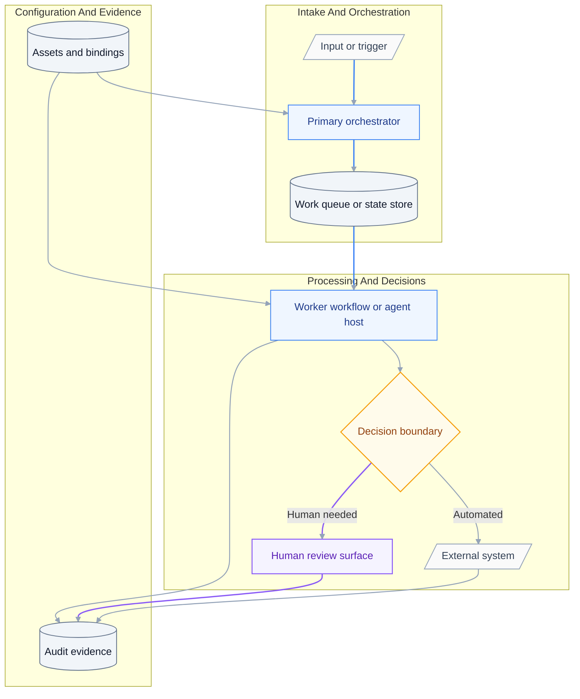
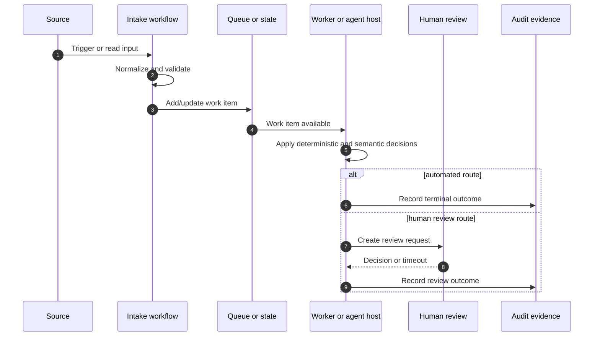
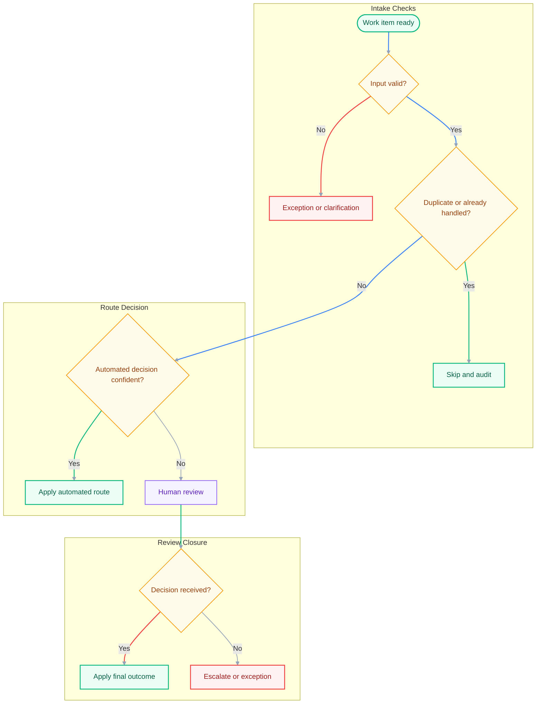
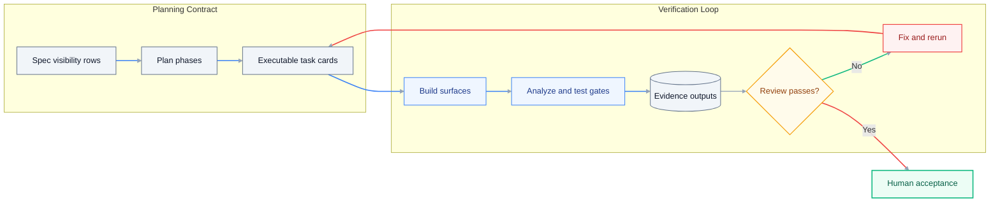
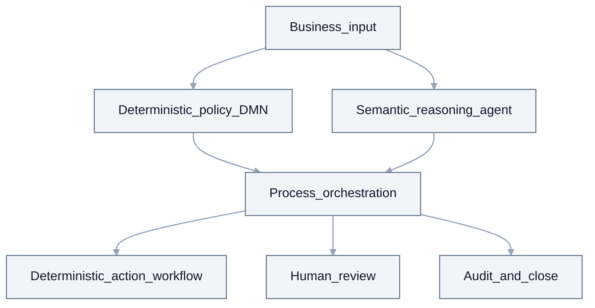
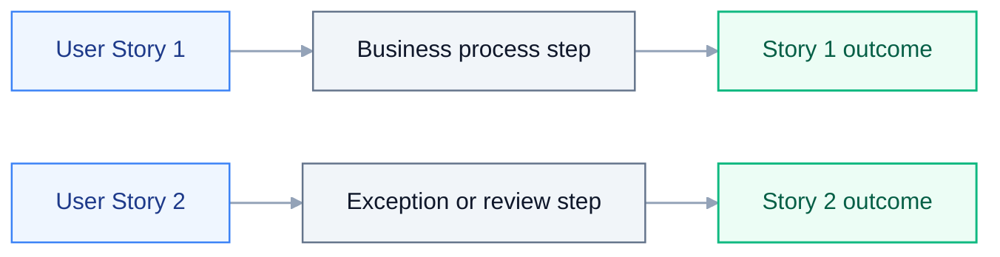

# Feature Specification: {{TITLE}}

> **Grounding:** {{GROUNDING_CITATIONS}}

**Created**: {{DATE}}
**Status**: Draft
**Input**: User description: "{{INTENT}}"

## Quick start (first draft in 15-30 minutes)

1. Fill `## User Scenarios & Testing` with real user stories and independent tests.
2. Fill `## Requirements` with concrete FRs and entities.
3. Fill `## LLM / Executor Readiness Contract` with in-scope surfaces and guardrails.
4. Fill `## 360 Build Visibility Contract` with artifact/resource/evidence rows.
5. Keep unknowns explicit as `[NEEDS CLARIFICATION: ...]` and continue.

## Accessibility and readability checklist

- Use short, direct sentences and avoid jargon where possible.
- Keep lists as single-purpose bullets (one idea per bullet).
- Keep headings in order and avoid skipping levels.
- Keep table labels explicit so rows are understandable out of context.
- Prefer concrete examples over abstract instructions.

## Audience and Scope

This document is the **BA <-> Developer** bridge and the mandatory scope
contract for `plan.md` and `tasks.md`. The formal PDD and SDD remain the
readable human documentation, but this spec must still expose full 360
build-visibility for every in-scope surface.

- **Do** describe outcomes, actors, business rules, and what success means in
  plain language.
- **Do** point to PDD / SDD source documents instead of copying their prose.
- **Do** record SME / NEEDS CLARIFICATION items when business facts are unknown.
- **Do** list all in-scope workflow surfaces, descriptors, dependencies,
  connectors, resources, decision boundaries, logs, and evidence expectations.
- **Do** mark unknown details as explicit `[NEEDS CLARIFICATION: ...]` items.
- **Do not** use placeholders, generic "implement later" wording, or stub
  completion criteria.

If a role hits a knowledge gap while drafting this spec, follow the AskAI / Library
escalation ladder before asking the user: `uipath_library_search` /
`uipath_library_lookup` -> `uipath_doc_get_activity` / `uipath_doc_list_packages` ->
`query_uipath_docs` -> specialist skill or `[agent:uipath-project-discovery-agent]`,
then user.

_If a PDD/SDD path was supplied, it appears as a source path only. The generator
uses it as context, but does not copy PDD/SDD prose into this spec._

## Design source priority

1. **SDD** (`sdd.md` or equivalent) is the primary source when it exists — align scope, integrations, and NFRs to it.
2. **PDD** or product brief when no SDD exists.
3. **User description** in this file when neither document exists.

Record production gaps as explicit clarification items until an SME confirms;
never invent tenant mailboxes, credentials, Zip handling mode, or other
tenant-specific values.

## User Scenarios & Testing

Write stories so a new project team can execute them without hidden context.

### User Story 1 - {{US1_TITLE}} (Priority: P1)

{{US1_BODY}}

**Why this priority**: {{US1_PRIORITY}}

**Independent Test**: {{US1_TEST}}

**Acceptance Scenarios**:

1. **Given** {{US1_GIVEN_1}}, **When** {{US1_WHEN_1}}, **Then** {{US1_THEN_1}}

### User Story 2 - {{US2_TITLE}} (Priority: P2)

{{US2_BODY}}

**Why this priority**: {{US2_PRIORITY}}

**Independent Test**: {{US2_TEST}}

**Acceptance Scenarios**:

1. **Given** {{US2_GIVEN_1}}, **When** {{US2_WHEN_1}}, **Then** {{US2_THEN_1}}

### Edge Cases

- {{EDGE_1}}

## Requirements

### Functional Requirements

- **FR-001**: System MUST {{FR_001}}
- **FR-002**: System MUST {{FR_002}}
- **FR-003**: Users MUST be able to {{FR_003}}

### Key Entities

- **{{ENTITY_1}}**: {{ENTITY_1_DESC}}

## LLM / Executor Readiness Contract

Keep this section concise and high-signal. It defines guardrails and routing so
`plan.md` and `tasks.md` are generated consistently.

### Role and scope

- **Project type**: {{PROJECT_TYPE}}
- **Allowed build surfaces**: {{ALLOWED_SURFACES}}
- **Languages / runtimes**: {{LANG_VERSION}}
- **Explicit exclusions**: {{EXPLICIT_EXCLUSIONS}}

### Environment and conventions

- **Required CLIs**: `uipcli`, `uipath`, `uip` (list only those in scope)
- **Access requirements**: {{TARGET_PLATFORM}}
- **Package manager/runtime**: {{DEPS}}
- **Evidence location convention**: {{EVIDENCE_PATHS}}
- **Naming/folder convention notes**: {{NAMING_CONVENTIONS}}

### Skill routing matrix

| Feature area | Required skill/tool | Use when | Evidence expected |
| --- | --- | --- | --- |
| Flow/process orchestration | `[skill:uipath-maestro-flow]` | `.flow`/BPMN orchestration, HITL stage in Flow | flow validation/export log + flow artifact path |
| LangGraph or coded agent | `[skill:uipath-agents]` | semantic reasoning, multi-source retrieval, agent execution | pytest/JUnit + `uipath run` evidence |
| Deterministic business rules | `[skill:dmn-business-rules]` | policy decision table with typed IO | `.dmn` + rule coverage test evidence |
| RPA workflow implementation | `[skill:uipath-rpa]` | `.xaml` activity-first implementation | analyze JSON + workflow test evidence |
| Platform/resources/deploy gates | `[skill:uipath-platform]` | queues/assets/folders/bindings/deploy policy | binding/resource diff + CLI logs |
| Test/diagnostics | `[skill:uipath-test]`, `[skill:uipath-diagnostics]` | verification failures and rerun loop | parsed failure + rerun evidence |

If a row is not used, mark it out-of-scope explicitly.

### Decision logic inventory

| Decision | Owner surface | Why | Inputs | Outputs | Human review trigger |
| --- | --- | --- | --- | --- | --- |
| {{DECISION_1}} | {{DECISION_1_OWNER}} | {{DECISION_1_WHY}} | {{DECISION_1_INPUTS}} | {{DECISION_1_OUTPUTS}} | {{DECISION_1_REVIEW_TRIGGER}} |

Use this table to prevent scope drift between DMN policy logic, agent semantic
reasoning, and Flow/process branching.

### Build readiness checklist

- [ ] Required cloud/studio access identified for all in-scope surfaces.
- [ ] Required CLIs and runtime versions listed.
- [ ] In-scope deploy command availability verified from live CLI help (for Flow: confirm `uip solution upload`; do not assume `resource refresh` / `flow tidy` exist in this CLI build).
- [ ] Certificate trust chain preflight documented for cloud upload paths (no placeholder `NODE_EXTRA_CA_CERTS`; record approved fallback if needed).
- [ ] Flow runtime smoke requirement declared when Flow is in scope (`uip flow debug` or documented reason it is unsafe/unavailable).
- [ ] Flow project name, folder name, and `.flow` filename consistency declared (`project.uiproj` name must match the debug/upload artifact expected by the installed CLI).
- [ ] Windows Flow debug prerequisites declared when needed (`zip` executable availability, or documented shim/tool installation).
- [ ] Coded agent runtime smoke requirement declared when agents are in scope (unit tests + direct graph/function invocation + `uipath run` or documented platform blocker).
- [ ] Secrets represented as assets/env vars only.
- [ ] Runtime assets and queues are explicitly listed with target folder path,
  provisioning command family (`uip resource` for non-secret assets/queues),
  and secret handoff items for credentials.
- [ ] Test fixtures identified for each story.
- [ ] DMN explicitly marked in-scope or out-of-scope.
- [ ] Human approval gates called out where required.
- [ ] If any named project/workflow template is in scope, template provenance is
  explicit and completion criteria require the full template lifecycle:
  copy/export the selected template, read/inspect the copied project structure,
  preserve the generated runtime shape, customize the copied shell for the
  business process, and verify the customized shell.
- [ ] If mailbox intake is in scope, dispatcher-template provenance is explicit,
  the dispatcher template is described as a host shell for the business process,
  and completion criteria require both business-specific customization inside
  that shell and real mailbox read evidence (not stub IDs).
- [ ] If long-running workflow or HITL templates are in scope, AnalyzerRunner and
  HumanReview surfaces are described as host shells that must be copied/exported,
  inspected, customized in place, and verified with wait/resume, outcome, and
  correlation-log evidence.
- [ ] If coded agents are in scope, acceptance includes deployed invocation,
  output review, and Orchestrator trace/graph verification (entrypoint,
  package version, graph node spans), not only a successful job state.
- [ ] Visual documentation is complete: business process, solution
  architecture, runtime sequence, decision tree, workflow/artifact inventory,
  and verification/evidence map.

## 360 Build Visibility Contract

Every row in this section is mandatory for in-scope surfaces. If a value is
unknown, use `[NEEDS CLARIFICATION: ...]` and keep the row.

### Workflow and artifact visibility inventory

| Artifact path | Type/surface | Owns user story | Invocation entrypoint | Cannot be stubbed by | Evidence required |
| --- | --- | --- | --- | --- | --- |
| {{ARTIFACT_1_PATH}} | {{ARTIFACT_1_TYPE}} | {{ARTIFACT_1_STORY}} | {{ARTIFACT_1_ENTRYPOINT}} | {{ARTIFACT_1_ANTISTUB}} | {{ARTIFACT_1_EVIDENCE}} |

### Activity, connector, dependency, and package visibility

| Package/tool | Activity or connector | Used in artifact | Why required | Version/source | Verification evidence |
| --- | --- | --- | --- | --- | --- |
| {{DEP_1_PACKAGE}} | {{DEP_1_ACTIVITY_CONNECTOR}} | {{DEP_1_ARTIFACT}} | {{DEP_1_REASON}} | {{DEP_1_VERSION_SOURCE}} | {{DEP_1_EVIDENCE}} |

### Agent, DMN, Flow, HITL, and platform-resource visibility

| Surface/resource | Descriptor/file | Invocation boundary | Inputs/outputs | Owner | Evidence |
| --- | --- | --- | --- | --- | --- |
| {{SURFACE_1_NAME}} | {{SURFACE_1_DESCRIPTOR}} | {{SURFACE_1_BOUNDARY}} | {{SURFACE_1_IO}} | {{SURFACE_1_OWNER}} | {{SURFACE_1_EVIDENCE}} |

### Logging and observability visibility

| Workflow/surface | Required log phases | Correlation id propagation | Expected assertions | Evidence path |
| --- | --- | --- | --- | --- |
| {{LOG_1_SURFACE}} | {{LOG_1_PHASES}} | {{LOG_1_CORRELATION}} | {{LOG_1_ASSERTIONS}} | {{LOG_1_EVIDENCE}} |

### Template/scaffold provenance and anti-stub rules

| Artifact | Scaffold/template source | Preserved from scaffold | Must be implemented (not stubbed) | Stub rejection signal |
| --- | --- | --- | --- | --- |
| {{SCAFFOLD_1_ARTIFACT}} | {{SCAFFOLD_1_SOURCE}} | {{SCAFFOLD_1_PRESERVE}} | {{SCAFFOLD_1_REQUIRED}} | {{SCAFFOLD_1_REJECT_SIGNAL}} |

If the scaffold names a concrete project/workflow template, treat it as a
**host shell** unless the accepted plan documents otherwise. Copying or exporting
the template proves only the starting runtime shape. Acceptance still requires
the executor to read/inspect the copied template's workflows, config, arguments,
variables, dependencies, and extension points; preserve the generated control
flow; customize the business-specific logic inside the copied shell; and verify
the customized shell rather than the copied baseline.

For dispatcher templates, that means business-specific configuration, connector
intake, queue payload mapping, idempotency/cursor behavior, phase logging, and
smoke evidence inside the copied dispatcher shell. For Long Running Workflow /
AnalyzerRunner templates, that means queue item handling, wait/resume behavior,
coded-agent invocation, response mapping, status transitions, and log evidence.
For HITL templates, that means the review schema, outcomes, timeout/escalation
rules, return path, and downstream update logic are implemented in the copied
HITL shell.

### Verification and evidence visibility

| Surface | Command family | Concrete command to run | Done-when condition | Evidence output path |
| --- | --- | --- | --- | --- |
| {{VERIFY_1_SURFACE}} | {{VERIFY_1_FAMILY}} | {{VERIFY_1_COMMAND}} | {{VERIFY_1_DONE_WHEN}} | {{VERIFY_1_EVIDENCE}} |

### Workflow-level visual and activity conformance

Every executable workflow surface must be visualized and tied to concrete
activities/nodes (no generic placeholders).

| Workflow artifact | Diagram section (spec/plan/tasks) | Mandatory activities/nodes | Skill/tool route | Verification evidence |
| --- | --- | --- | --- | --- |
| {{WF_1_PATH}} | {{WF_1_DIAGRAM_SECTION}} | {{WF_1_MANDATORY_ACTIVITIES}} | {{WF_1_SKILL_TOOL_ROUTE}} | {{WF_1_EVIDENCE}} |

### Workflow surface visual catalog (required)

For every in-scope workflow artifact listed above, add a dedicated subsection
and Mermaid internal-step flow. Keep one subsection per artifact path.

#### `{{WF_1_PATH}}`

Repeat this pattern for each workflow artifact (`.xaml`, `.flow`, workflow
`.py`, `.dmn`) in scope.

### Clarification resolution ledger

Track unresolved business/technical facts so `plan.md` and `tasks.md` can map
them to concrete owners and closure tasks.

| Marker | Question | Owner role | Resolve in | Closure signal |
| --- | --- | --- | --- | --- |
| `[NEEDS CLARIFICATION: <topic>]` | `<question text>` | BA / SA / SME | `spec.md` or `plan.md` | marker removed + decision recorded |

### Worked example (required)

Add one concise example mapping:
`user story -> plan phase -> task card -> verification evidence`.
The example must reference one concrete row from the 360 visibility tables.

## Visual Documentation Contract

The spec, downstream `plan.md`, and downstream `tasks.md` must use visuals as
build instructions, not decoration. Every diagram must follow
`[skill:mermaid-diagram-builder]` Pro Standard: meaningful shapes, `classDef`
styling on flowcharts, muted default links, highlighted critical paths, and no
inline `style ... fill` overrides.

Required visual set:

| Visual | Required in | Purpose | Must show | Done when |
| --- | --- | --- | --- | --- |
| Business process flow | `spec.md` | stakeholder-readable outcome path | actors, trigger, major decisions, terminal outcomes | all user stories represented |
| Solution architecture | `spec.md` and `plan.md` | artifact and system boundaries | workflows, agents, flows, queues/assets, connectors | each artifact maps to 360 table rows |
| Runtime sequence | `plan.md` | message handoff timing | caller/callee, inputs/outputs, HITL callback/writeback | each handoff has an input/output contract |
| Decision tree | `spec.md` and `plan.md` | routing ownership | deterministic rules, agent decisions, human-review triggers, exceptions | each branch maps to status and owner |
| Workflow internals | `plan.md` and `tasks.md` | executor build guidance | one internal-step diagram per executable workflow | no workflow is a black box |
| Evidence map | `tasks.md` | verification completeness | command, output path, pass/fail gate, rerun loop | each task has evidence output |

### Business process flow (required)

This diagram shows how work happens today, manually — the AS-IS process before automation. It shows actors, handoffs, channels, and pain points.

**Pain points**:
- Manual handoffs cause delays
- No audit trail
- High error rate in manual data entry

### Solution architecture (required)

This is the TO-BE automated solution architecture.

### Runtime sequence diagram (required)

### Routing decision tree (required)

### Evidence coverage map (required)

### Decision boundary map

## Business Scope Map

Plain-language scope boundary for the business process. Keep this human-readable;
technical topology belongs in `plan.md`.

## Story Journey Map

Map each user story to its business outcome. Keep implementation details for
`plan.md` and `tasks.md`.

## Success Criteria

### Measurable Outcomes

- **SC-001**: {{SC_001}}

## Assumptions

- {{ASSUMPTION_1}}

## SME inputs (do not invent)

Until the human confirms facts, record gaps as explicit SME review or
clarification prose. Examples: mailbox allow-lists, credential scope, Zip
handling mode, audit log sink, trigger cadence, and human review channel. Do not
silently invent production values.

## Source routing & MCP contracts

{{SOURCE_ROUTING_SNIPPET}}

## Development Handoff

This section does not design the implementation. It only points the next stages
in the right direction. `plan.md` owns architecture and capability routing;
`tasks.md` owns executor-grade build details.

- **Planning entry point**: create or refresh `plan.md` from this spec and the
  referenced PDD / SDD.
- **Implementation scope**: {{IMPLEMENTATION_SCOPE}}
- **Implementation paradigm**: {{PARADIGM}}
- **CLI family**: {{CLI_FAMILY}}
- **Handoff note**: values above are planning hints only; `plan.md` owns the final
  architecture decision and exact commands belong in `plan.md` / `tasks.md`.
- **Review gate**: `uipath_plan_review` must pass before acceptance.
- **Build handoff**: after review and human acceptance, execute `tasks.md`.
- **Open facts**: any production-critical fact not confirmed by PDD / SDD / SME
  stays in **SME inputs**; do not invent it in `plan.md` or `tasks.md`.

## LLM navigation map

Use this as the "where to read next" contract for deterministic LLM execution.

| Need | Read first | Then read | Output expected |
| --- | --- | --- | --- |
| Scope and success boundaries | User stories + FR/SC | `## 360 Build Visibility Contract` | in-scope artifacts and outcomes |
| Skill/tool routing | `### Skill routing matrix` | `## Source routing & MCP contracts` | resolved capability path |
| Architecture and implementation steps | `plan.md` | `tasks.md` | executable sequence with evidence paths |
