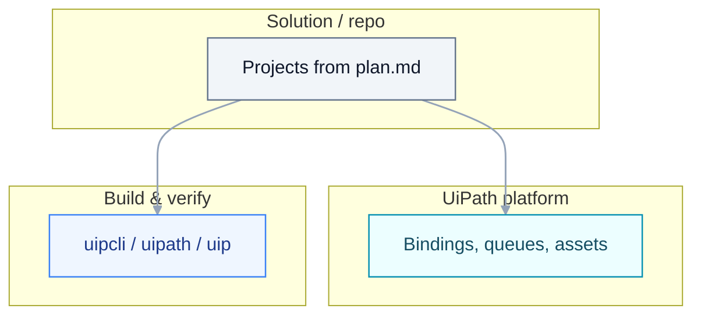
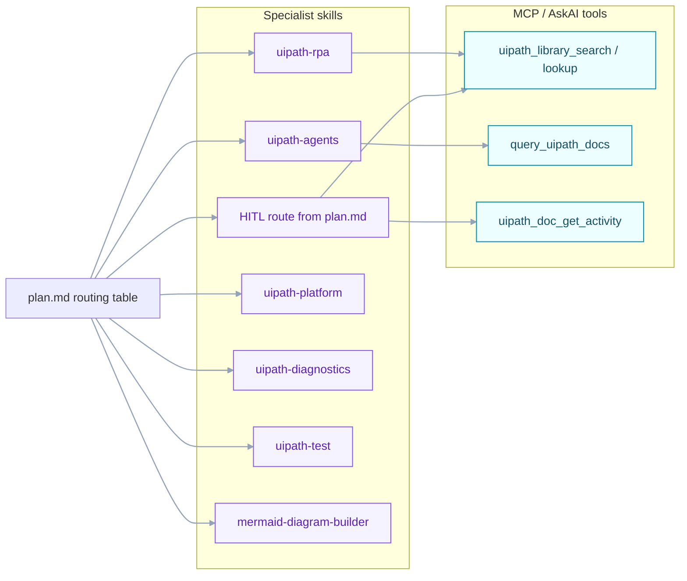
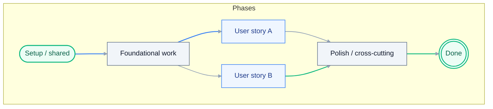
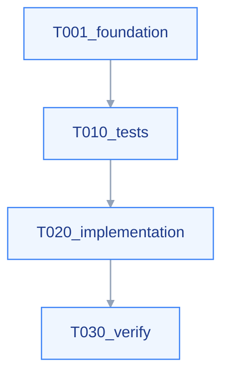
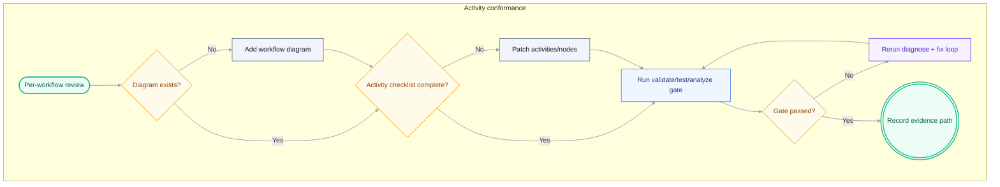
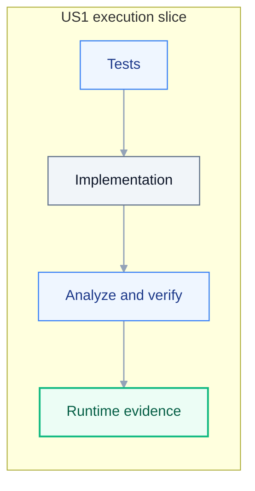
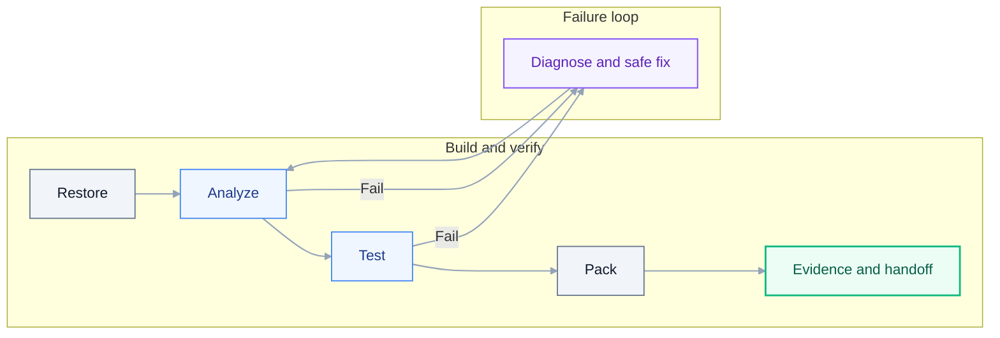

# Tasks: {{TITLE}}

> **Grounding:** {{GROUNDING_CITATIONS}}
> **Input**: `./spec.md`, `./plan.md`

**Format**: `[ID] [P?] [Story] Description` - include exact file paths in descriptions (backticks).

## Quick start (authoring executable tasks)

1. Build `## 360 visibility execution matrix` from artifacts in `plan.md`.
2. Add FR mappings in `## FR traceability matrix`.
3. Write tests before implementation inside each story phase.
4. For each non-parallel task, include command + evidence path + ownership tags.
5. Ensure Phase 5 includes restore -> analyze -> test -> pack and runtime evidence.

## Accessibility and readability checklist

- Keep task lines short, concrete, and command-oriented.
- Put one done condition per task line.
- Avoid combining unrelated work in a single task.
- Keep acronyms expanded at first use in each section.
- Ensure tables can be read without prior context.

## Audience and Scope

This document is the **Solution Engineer -> Developer / Executor** build sheet.
Every architectural and routing decision in `spec.md` and `plan.md` is assumed
settled. Each task line is a single done gate with: artifact path, project,
workflow type, package/activity (when applicable), CLI command, evidence path,
skill / agent / subagent / MCP-tool tag, and acceptance.

- **Stack policy**: Modern UiPath Studio (latest), C# expressions, Windows,
  .NET 8. Prefer UiPath activities (`uipath_doc_get_activity`); coded
  automation (`.cs` workflow) only when justified in `plan.md`'s
  `## Coded Surface Justification`. **No Legacy / VB.Net / Classic.**
- **Capability routing**: every implementation task carries one or more of
  `[skill:...]`, `[agent:...]`, `[subagent:...]`, `[library:...]`, `[askai:...]`.
- **AskAI / Library ladder**: when uncertain, run `uipath_library_search` /
  `uipath_library_lookup` -> `uipath_doc_get_activity` -> `query_uipath_docs`
  -> specialist skill -> ask user (recording attempts).

See [`docs/uiplan/TASK_AUTHORING.md`](../../docs/uiplan/TASK_AUTHORING.md) for
the canonical workflow-design, capability-routing, handoff, and implementation
loop contract.

## Task generation preconditions (already completed)

`/uiplan-tasks` is a build-contract stage. It must consume completed discovery
and grounding, not recreate them as checklist items.

Before generating tasks:

- `spec.md` and `plan.md` are present and reviewable for this slug.
- Project discovery output exists (for example `.claude/rules/project-context.md`)
  and key project surfaces are already captured in `plan.md`.
- `plan.md` includes per-project workflows, template/scaffold decisions, source
  paths, bindings/queues/assets, and build gates.
- Activity/package lookup inputs are known through `uipath_library_search`,
  `uipath_library_lookup`, `uipath_doc_get_activity`, or equivalent grounding.

If these preconditions are not met, stop and rerun `/uiplan-ground` and/or
`/uiplan-plan` before generating `tasks.md`.

## How to read this task list

- **Tests**: failing-first checks that define expected behavior.
- **Implementation**: concrete workflow/graph/flow/app build tasks.
- **Build/Verify**: restore -> analyze -> test -> pack gates plus runtime smoke
  evidence for executable Flow/agent surfaces.
- **Diagnostics**: parse failures, inspect sources, apply safe fix, rerun.
- **Handoff**: approval-gated deployment and evidence summary tasks.

Every story block should include:

1. one-sentence purpose (`Why this exists`);
2. a story workflow/task map diagram;
3. tests before implementation;
4. explicit verification commands and runtime evidence paths.
5. an **Executor context** block (role/scope, environment, workflow, guardrails,
   tools, pattern anchors, return/evidence expectations).
6. actual per-workflow diagrams that show the desired internal step flow.

## 360 visibility execution matrix

Before writing phases, map every in-scope artifact from spec/plan to explicit task
IDs, verification command, and evidence path. If any artifact has no row, stop and
repair `plan.md` first.

| Artifact path | Surface | Owning story | Build task IDs | Verify command | Evidence path |
| --- | --- | --- | --- | --- | --- |
| `projects/<Name>/Main.xaml` | RPA | US1 | `T011A` | `uipcli package analyze ... --resultPath out/analyze.json` | `out/analyze.json` |

## FR traceability matrix (required)

Every FR in `spec.md` must map to at least one executable task ID.

| FR | Covered by task IDs | Primary artifact(s) | Verification evidence |
| --- | --- | --- | --- |
| `FR-001` | `T010`, `T011A` | `<paths>` | `<evidence file>` |

## Clarification resolution ledger (required)

Convert unresolved clarification markers into explicit closure tasks.

| Marker | Resolution owner | Resolution task ID | Done when |
| --- | --- | --- | --- |
| `[NEEDS CLARIFICATION: <topic>]` | BA / SA / SME | `T0xx` | decision recorded and marker removed |

## Log assertion checklist (required)

List expected runtime log assertions by surface before implementation.

| Surface | Required log markers | Correlation id key | Assertion task ID | Evidence output path |
| --- | --- | --- | --- | --- |
| `<artifact path>` | start, input, decision, terminal | `<correlation field>` | `T0xx` | `out/<log-file>.log` |

## Resource provisioning checklist (required for Orchestrator-dependent tasks)

Every queue, asset, folder, connection, or binding used by the automation must be
provisioned and verified before deployment smoke tests. See
[ACTIVITY_AND_RUNTIME_EVIDENCE.md](../../docs/uiplan/ACTIVITY_AND_RUNTIME_EVIDENCE.md)
§Orchestrator resource lifecycle for the complete contract.

| Resource | Type | Target Folder | Provisioning Command | Verification Command | Evidence Path | Provisioning Task ID | Notes |
| --- | --- | --- | --- | --- | --- | --- | --- |
| _IntakeQueue_ | Queue | _Shared/Dev_ | `uip or queues create --name IntakeQueue --folder-id <id> --output json` | `uip or queues list --filter "name eq 'IntakeQueue'" --output json` | `out/queue-create.json`, `out/queue-verify.json` | `T0xx` | _stores intake items_ |
| _LLMApiKey_ | Asset (text secret) | _Shared/Dev_ | `[HANDOFF:Secrets]` | `uip or assets list --filter "name eq 'LLMApiKey'" --output json` | `out/asset-verify.json` | `T0xx` | _secret credential_ |

## Activity evidence checklist (required for RPA/XAML tasks)

Every non-trivial activity (beyond basic `Sequence`, `Flowchart`, `If`, `Assign`,
`Log Message`, `Try Catch`) must be grounded in activity docs before implementation.
See [ACTIVITY_AND_RUNTIME_EVIDENCE.md](../../docs/uiplan/ACTIVITY_AND_RUNTIME_EVIDENCE.md)
§Activity selection grounding for the complete contract.

| Workflow | Activity | Package | Version | Required Scope | Required Props | Default XAML / Evidence | Activity Lookup Task ID |
| --- | --- | --- | --- | --- | --- | --- | --- |
| _Main.xaml_ | _Get Mail Messages_ | _UiPath.Mail.Activities_ | _1.23.11_ | _Use Outlook 365_ | _MailFolder, Top, Messages_ | `uip rpa get-default-activity-xaml` output or Studio scaffold | `T0xx` |

## UAT/test evidence checklist (required for production-bound stories)

Every production-bound user story must include automated test workflows or documented
manual UAT. See [ACTIVITY_AND_RUNTIME_EVIDENCE.md](../../docs/uiplan/ACTIVITY_AND_RUNTIME_EVIDENCE.md)
§UAT/test evidence for the complete contract.

| User Story | Scenario | Test Artifact | Execution Command | Evidence Path | AC Mapping | UAT Task ID |
| --- | --- | --- | --- | --- | --- | --- |
| _US1_ | _Happy path: valid invoice_ | `Tests/ValidInvoice.xaml` | `uipcli test run -a <key> .` | `out/test-results.xml` | AC1, AC2 from spec | `T0xx` |
| _US1_ | _Failure path: invalid date_ | `Tests/InvalidDate.xaml` | `uipcli test run -a <key> .` | `out/test-results.xml` | AC3 from spec | `T0xx` |

## Executor context template (required per phase or story)

```markdown
### Executor context for <phase/story>
- **Role/scope**: <what to build and boundaries>
- **Environment**: <required CLIs/runtimes/access + evidence paths>
- **Workflow**: read/explore -> implement minimal scope -> verify -> parse output -> safe fix -> rerun
- **Guardrails**: <non-negotiables>
- **Tools**: <skills + MCP + CLI order>
- **Patterns**: <existing files/templates to mirror>
- **Return/evidence**: <what must be reported>
```

## Task detail contract

Every **non-[P]** checklist task MUST embed the following (inline on the same bullet or as indented sub-bullets):

- **Feature build surface**: RPA/Studio, Maestro/Flow, coded app/action, coded agent (`LangGraph` / `LlamaIndex`), platform/config, docs-only, or a named combination.
- **Project** (Studio project / agent package / app name) or owning repo path
- **Starter template / scaffold source** for Studio projects: named template, `uip rpa create-project`
  evidence, existing `project.json` / `project.uiproj` provenance, and workflow-type rationale.
- **Workflow / sequence / node** (`.xaml` / `.cs` workflow / LangGraph node / CLI step)
- **Artifact path** in backticks (source, test, binding, or policy file)
- **UiPath construct** (queue, asset, folder, binding key, graph, process)
- **Activities / SDK calls** only after `uipath_doc_get_activity` documents the concrete package and activity (cite names in prose once resolved; avoid unresolved activity-colon placeholders in committed tasks — they fail `uipath_plan_review` activity-doc checks).
- **AskAI / library lookup**: `uipath_library_search` / `uipath_library_lookup`; `query_uipath_docs` only when library coverage is insufficient; cite durable findings as `[library:...]` or `[askai:...]`
- **Verification**: exact command (`uv run pytest ...`, `uipcli test run ...`, `uipcli package analyze ...`, `uipath run ...`) plus expected pass/fail
- **Runtime evidence**: path or artifact for proof (JUnit/pytest report, analyzer `--resultPath` JSON, `.nupkg` path, robot/job log excerpts)
- **Prerequisites**: upstream task IDs and required pre-existing artifacts
- **External dependencies**: systems, permissions, policies, or SME approvals needed
- **Tooling/access**: concrete local and cloud access needed to execute and verify
- **Actual flow diagram references**: each workflow artifact in scope must have a
  matching diagram section that describes the intended internal step sequence.

**Tests before implementation** within each user story: `### Tests` precedes `### Implementation`.

### Task card format (preferred)

After each non-`[P]` task line, include a one-row card table:

| Field | Content |
| --- | --- |
| Pre-reqs | `<task IDs + required artifacts>` |
| Depends on | `<systems/policies/permissions>` |
| Tooling / access | `<CLI/runtime/cloud/studio requirements>` |
| Build surface | `<RPA / Flow / agent / platform / combo>` |
| Verify / evidence | `<command + evidence path>` |
| Skills / MCP | `<[skill:...] [library:...] [subagent:...]>` |

### Project-specific contract

Every generated task list MUST include project facts from `spec.md` / `plan.md`, not generic placeholders:

- **Repo / solution root** and exact project directories (`projects/<Name>/`, `bindings/*.json`, `tests/`, app/agent folders).
- **Existing descriptors** (`solution.uipx`, `project.json`, `langgraph.json`, `app.config.json`, `.flow` / BPMN, `caseplan.json`) and whether they are existing, generated, or to be created.
- **Environment bindings**: queue names, asset names, connection names, schedules/triggers, folder/workspace defaults, and which values are tenant-only.
- **Studio/tooling facts** for RPA: Studio path or `uip rpa` discovery evidence, `uip rpa create-project` / default activity XAML evidence when creating or wiring Studio activities, `uipcli` restore/analyze/pack commands, and analyzer policy exceptions.
- **Studio designer validation gate** for RPA: every generated or edited `.xaml`
  artifact must have a task-level `uip rpa get-errors --file-path ... --project-dir ... --studio-dir ... --output json`
  check that returns `No diagnostics found`. The project must also run
  `uip rpa build --project-path ... --studio-dir ... --output json` before pack
  or deploy. If Studio is holding the project open, close it with
  `uip rpa close-project --project-dir ... --studio-dir ... --output json` and
  rerun the build. `uipcli package analyze`, solution pack, deployment, or a
  successful Orchestrator job does **not** replace this gate.
- **Studio template decisions** for each RPA project: Dispatcher/scheduled intake, Performer/queue
  worker, Long Running Workflow/HITL, Sequence/Flowchart/State Machine, or project-specific custom
  template. Each row must include why that template fits the use case and what generated structure
  must be preserved.
- **Named template lifecycle**: when a task says to use a concrete template,
  generated tasks must require this sequence before the story can close:
  copy/export the selected template into the target project folder; read/inspect
  the copied project's workflows, config, arguments, variables, dependencies,
  and extension points; preserve the generated runtime shape; customize the
  copied shell in place for the specific business process; and verify the
  customized shell. A template copy/export task is never the final business
  implementation task unless the task is explicitly scaffold-only and a named
  customization task remains open.
- **Mailbox dispatcher guardrail**: if a task builds or remediates mailbox intake
  that queues work, it must physically copy or export the dispatcher project
  from `scaffold/template/dispatcher` (or name the exact Studio template export
  path) into the target dispatcher project folder before any customization.
  Citation-only provenance is not enough. The dispatcher template is a shell
  that hosts the actual business process; it is not complete just because it was
  copied. The copied project must retain the dispatcher structure (`Data/`,
  `Framework/`, `Logical/`, `Templates/`, `Main.xaml`, `Process.xaml`, and the
  queue push workflow) unless the accepted plan records an approved equivalent
  template. Follow-on mailbox read, non-stub queue payload, idempotency/cursor,
  and phase log tasks must customize that host shell in place by wiring the
  business-specific intake logic into its config, process workflow, logical
  components, and queue handoff. Do not replace it with standalone log-only
  workflows. Evidence must include the copy/export source, target path, copied
  file inventory, business-specific config diff, customized workflow evidence,
  one real connector-read smoke log (safe sample scope is acceptable), queue item
  proof, and correlation-id log assertions. A `PullMailbox` workflow that only
  logs or fabricates `stub-*` message IDs cannot close the story.
- **Long-running AnalyzerRunner guardrail**: if a task builds an
  AnalyzerRunner, performer, or queue-worker host that waits for coded-agent or
  human-review outcomes, it must use the accepted Long Running Workflow template
  (or name the exact approved equivalent), copy/export or scaffold it into the
  target project folder, read the copied workflow structure, and customize its
  wait/resume, queue item, agent invocation, response mapping, status
  transition, and log phases in place. A standalone `Main.xaml` that only logs
  "invoke agent" is not a valid long-running workflow implementation.
- **HITL template guardrail**: if a task builds a HumanReview/HITL surface, it
  must use the accepted HITL template/canvas, copy/export or scaffold it into the
  target project folder, read the copied review workflow/schema structure, and
  customize review inputs, outcomes, timeout/escalation handling, return path,
  and downstream update logic in place. Evidence must cover completed,
  cancelled, and timeout/exception routing unless the accepted plan explicitly
  defers a path.
- **Agent facts** for agent-backed features: `langgraph.json` / `llama_index.json`, graph entry point, node list, model/gateway assumptions, local `uipath run` or pytest command, and host invocation schema.
- **Agent deployment acceptance** for coded agents: after publish/deploy, invoke
  the deployed entrypoint with safe input, read job output and logs, fetch traces
  where supported, and verify Orchestrator shows the expected graph/node spans
  and package version. Use the coded-agent lifecycle when the environment uses
  the unified CLI: `uip codedagent init`, local `uip codedagent run`, `uip
  codedagent push` with `UIPATH_PROJECT_ID` when Studio Web project binding is
  required, `uip codedagent deploy --my-workspace`, then `uip codedagent invoke
  <ENTRYPOINT> '<safe-json>'`. A green job with placeholder output is not
  complete.
- **RPA-to-agent host boundary acceptance**: when an RPA workflow, Flow, or app is
  expected to call a coded agent, local `uipath invoke` evidence is not enough.
  Tasks must prove the host can call the agent from the target Orchestrator
  folder through a supported surface (`Call Agent`, `Invoke Process` / `Run Job`
  with returned output, or documented platform API wrapper). For `Run Job`,
  populate business arguments and bind non-empty typed `Input`/`Output` objects
  whenever the process exposes typed bundles. If the agent package deploys but is
  not visible as a callable process/resource in the target folder, keep a named
  remediation task open and do not mark the host invocation complete.
- **No placeholder completion**: Flow, agent, RPA, app, and HITL tasks are not
  done when nodes only say "placeholder", "would invoke", "contract only", or
  "scaffold". If the installed CLI/platform cannot expose a real callable node,
  tasks must capture registry/process evidence, keep a named remediation task
  open, and still prove the closest executable boundary with runtime smoke
  evidence (`uip flow debug`, `uipath invoke`, job logs, or equivalent).
- **Feature ownership**: for mixed Solutions, split work by feature + artifact. Do not let a single “solution” task hide RPA, Flow/Maestro, coded app, agent, and platform work.

### Executable task split (default — no “half” tasks)

Every checklist line must be **fully completable** under a single, explicit **Done when** (verification + evidence). **Do not** merge unrelated concerns into one bullet unless scope is explicit.

**Match the use case (paradigm + spec):**

- **When the use case includes Studio / RPA / `.xaml`** (e.g. `modern-rpa`, `solution` with process projects, coded-automation with workflows): tasks **must** drive **building those workflow artifacts** — not only bindings, Python, or tests. Use the tools you have: **`uipath_doc_get_activity`**, **`uipath_library_search` / `uipath_library_lookup`**, **`[skill:uipath-rpa]`**, **`uipcli package restore|analyze|pack`**, and edit **`*.xaml` / `project.json` in the repo** (Studio Desktop **or** the same files in the editor + Studio/CLI validation). Skipping production activities when they are in scope is wrong.
- **When the use case includes Maestro / Flow**, tasks must name `.flow` / BPMN artifacts, Studio Web / `uip` validation path, triggers, data mappings, solution packaging boundary, and runtime smoke evidence via `uip flow debug` unless debug is unsafe or unavailable.
- **When the use case includes coded app / action app**, tasks must name `app.config.json`, `action-schema.json`, TypeScript entry points, `uip codedapp` build/test commands, and Solution packaging boundary.
- **When the use case is coded-agent / Python-only** (no XAML in the plan): the workflow surface is **graph / code** — do not invent RPA-only tasks.
- **When RPA / Flow / app invokes an agent**, tasks must include both sides: the host artifact (`Main.xaml`, `.flow`, app action) and the agent artifact (`langgraph.json` / `llama_index.json`) plus request/response schema and local execution evidence.

### Local validation and tenant evidence requirements

Every build/pack task must include **local validation evidence** before deployment.
See [ACTIVITY_AND_RUNTIME_EVIDENCE.md](../../docs/uiplan/ACTIVITY_AND_RUNTIME_EVIDENCE.md)
§Local Studio evidence for the complete contract.

**Required local validation steps** (before pack/deploy):
1. `uip rpa get-errors --file-path <workflow>.xaml --project-dir <project-root> --output json` (0 errors)
2. `uip rpa build <project-root> --output json` (success)
3. `uipcli package analyze <project-root>/project.json --resultPath out/<name>-analyze.json` (0 errors, warnings accepted or blocked)
4. Optional local smoke run (when safe and non-destructive)

Every deploy/smoke task must include **tenant evidence** or a structured blocker.
See [ACTIVITY_AND_RUNTIME_EVIDENCE.md](../../docs/uiplan/ACTIVITY_AND_RUNTIME_EVIDENCE.md)
§Tenant evidence for the complete contract.

**Required tenant evidence components** (for deploy/smoke tasks):
1. Target folder (must be non-Production: personal workspace, Dev, or Test)
2. Package/process version deployed
3. Job or agent invocation ID
4. Final state (Successful, Faulted, Stopped)
5. Job logs with expected markers (phase, correlation ID, business outputs)
6. Queue item or asset proof (when applicable)
7. OR a structured blocker JSON explaining why tenant evidence is unavailable

**Local-ready vs tenant-verified:** a task marked `local-ready` has passed analyzer
and local validation but lacks tenant deployment/smoke evidence. This is acceptable
when tenant credentials, folder permissions, or runtime environment are unavailable.
However, such tasks must record a structured blocker and must not be considered
complete for production sign-off.

### Studio and agent execution contracts

For **RPA / Studio** tasks:

- New Studio projects must be scaffolded with `uip rpa create-project --studio-dir <path>` when Studio is available; if an existing project is used, record the existing `project.json` / `project.uiproj` as the scaffold source.
- Before any activity wiring, tasks must choose and record the **starter template** per Studio
  project. Examples: Dispatcher/scheduled intake template for mailbox polling and enqueue,
  Performer/queue-worker template for transaction processing, Long Running Workflow/HITL template
  for human waits, Sequence for deterministic linear work, Flowchart for branching, State Machine
  for stateful transitions. If template selection is still uncertain, stop and return to
  `/uiplan-plan`; do not emit discovery-question tasks in `tasks.md`.
- When a starter template is named, the task must require the executor to copy or
  scaffold that template, then read/inspect the copied template before changing
  it. The task must list the copied workflows/configs/arguments/extension points
  that drive the customization. The implementation task then modifies the copied
  shell in place for the specific business process.
- Template evidence is part of the done gate: generated files, command output, `project.json` /
  `project.uiproj`, workflow type, and preserved generated control-flow structure. A generic
  hand-written `Main.xaml` with `LogMessage` markers is scaffold-only and cannot satisfy a Studio
  project implementation task unless a follow-up template remediation task remains open.
- Template-copy evidence must include Studio Designer validation after use-case
  layering. This is required because copied VisualBasic templates can still run
  or pass package analyze while Studio flags missing imports/references such as
  `Dictionary` or `List` resolution errors.
- Non-trivial activities must come from `uipath_doc_get_activity` plus Studio/default-activity evidence (`uip rpa get-default-activity-xaml`, Studio-generated XAML, or documented package-local activity XAML). Do not hand-invent activity XML when a tool can generate it.
- Each activity-level task must name the package/activity, inputs, outputs, variables/arguments, connection/asset names, and analyze command.
- Studio validation evidence must come from Studio Designer or `uip rpa get-errors`
  / `uip rpa build` with `--studio-dir`; `uipcli package analyze` is a separate
  package/analyzer gate, not a substitute for designer validation.

For **agent-backed** tasks:

- Build the agent package when the feature needs agentic reasoning. Default to **LangGraph**; use **LlamaIndex** only when the plan explicitly calls for retrieval/document-heavy indexing.
- Tasks must name `langgraph.json` / `llama_index.json`, graph entry point, graph nodes/tools, request schema, response schema, local run command (`uipath run` or pytest), and the host invocation artifact.
- Agent tasks must prove the graph actually runs, not only imports: include pytest/JUnit,
  direct graph/function smoke output, and `uipath run` evidence where the platform
  runtime is available. If `uipath run` fails after folder/auth resolution, record the
  exact platform blocker and keep the local graph smoke as the code-level gate.
- Host workflows/flows/apps must explicitly include the Invoke Agent boundary (activity, command, or API wrapper) and how the response updates queues, forms, or downstream systems.

### Failure diagnosis contract

Generated tasks must not allow analyzer, solution, Studio, CLI, or agent test failures to be
summarized as blockers until the implementer has diagnosed and rerun them. Every Phase 5
verification path must require:

- evidence capture: exact command, working directory, exit code, result file path, and relevant output excerpt;
- structured parsing: analyzer rule IDs/severity/file/activity/message, or solution command failure class;
- grounding lookup: `uipath_library_search` / `uipath_library_lookup`, `query_uipath_docs` only when needed, relevant `uipath_doc_get_activity`, live CLI `--help`, or Studio IPC commands;
- source/schema inspection: affected `project.json`, `.xaml`, `solution.uipx`, bindings, generated metadata, or tool-generated examples;
- one safe local source/config/tooling fix attempt when evidence supports one, followed by the same verification rerun;
- blocker report only after rerun, with blocker class: tenant-only, human UI-only, missing credentials, generated descriptor required, unsupported local tooling, or unsafe action.

If `solution.uipx` is present, tasks must distinguish project-level restore/analyze from
`solution.uipx` descriptor validity and provenance (generated by Studio/Automation Cloud vs
placeholder/manual descriptor). If analyzer rules such as `ST-USG-034` appear, tasks must
require analyzer JSON parsing, docs/tooling lookup, Studio/project-setting inspection, a local
metadata fix attempt when safe, and rerun evidence.

**What `[HANDOFF:…]` is for (narrow):** secrets (`[HANDOFF:Secrets]`), tenant **deploy/publish** approval (`[HANDOFF:OrchestratorDeploy]`), first-time OAuth/browser consent, **physical robot / attended smoke** (`[HANDOFF:RobotSmoke]`). **Do not** use a handoff tag to mean “we will not implement `Main.xaml`” when XAML is in scope.

- Split tasks (e.g. `T011A`, `T011B`, …) when **scope** differs (scaffold vs production activities vs agent code), not to drop XAML from the plan.
- **Scaffold-only** XAML (`LogMessage` phase markers) is allowed **only** in bullets that explicitly say **scaffold-only** and must be **replaced** by production-activity tasks **before the story is done** when RPA is in scope.

## Project topology map



## Capability routing map



## Story execution map

Execution order vs. parallel tracks (replace with story IDs and real tasks).



## Phase dependency map (task IDs)

Keep one lightweight phase map with task IDs to reduce visual loops:



## LLM execution navigation guide

Use this map when executing `tasks.md` with an LLM.

| Need | Navigate to | Required output |
| --- | --- | --- |
| next executable task | phase sections (`T...`) + dependency map | one task in-progress with evidence plan |
| tool/skill for a task | task line tags + `## Capability routing map` | selected `[skill:]`, `[subagent:]`, MCP lookup |
| evidence requirements | task card + log assertion checklist | command + artifact + evidence path |
| unresolved blockers | clarification ledger + diagnosis contract | closure task or blocker class evidence |

## Workflow surface visual catalog (required)

For every workflow artifact listed in `plan.md` workflow catalog (for example
`.xaml`, `.flow`, LangGraph entrypoints, DMN decisions), include a diagram in
`tasks.md` that shows:

- entry trigger/input;
- internal step sequence and key branches;
- external calls/resources used;
- terminal outcomes and write-backs.

Do not use placeholder boxes only. The implementer should be able to build the
artifact directly from the diagram + task card.

For each listed workflow artifact, include:

- an alias line (`<artifact alias> -> <full repo path>`);
- a dedicated subsection such as `### Mini-topology: \`<full repo path>\``;
- one Mermaid diagram showing internal step flow for that artifact.

## Per-workflow activity checklist (required)

For each workflow artifact from `plan.md` workflow catalog, include one checklist
row that names the required activities/nodes and how they are verified.

| Workflow artifact | Activity/node checklist (must exist) | How to confirm | Skill/tool route | Evidence path |
| --- | --- | --- | --- | --- |
| `projects/<Name>/Main.xaml` | `Sequence`, `Switch`, `If`, `Assign`, `Log Message`, `Try Catch` | `uipath_doc_get_activity` + analyze output | `[skill:uipath-rpa]`, `uipath_doc_get_activity`, `uipcli` | `out/analyze-<name>.json` |
| `projects/<Name>/<flow>.flow` | trigger, normalize, branch node, closure node | flow graph review + validate | `[skill:uipath-maestro-flow]`, `uip` | `out/flow-validate.log` |

## Activity conformance gate visual (required)



## Phase 1: Contract and Test Baseline

**Why this exists**: lock executable contracts and baseline checks before source implementation.

### Executor context for Phase 1

- **Role/scope**: {{PHASE1_ROLE_SCOPE}}
- **Environment**: {{PHASE1_ENVIRONMENT}}
- **Workflow**: {{PHASE1_WORKFLOW}}
- **Guardrails**: {{PHASE1_GUARDRAILS}}
- **Tools**: {{PHASE1_TOOLS}}
- **Patterns**: {{PHASE1_PATTERNS}}
- **Return/evidence**: {{PHASE1_EVIDENCE}}

- [ ] T001 [P] [US1] {{T001}}
- [ ] T001A [US1] Run the compatibility preflight from [docs/ORCHESTRATOR_DEPLOYMENT.md](../../docs/ORCHESTRATOR_DEPLOYMENT.md) before scaffolding, package selection, pack, publish, or deploy; for Flow include `uip flow --help` / `uip solution --help` command availability, cloud-upload trust-chain checks, `zip` executable availability on Windows, and project folder/name/`.flow` filename consistency; record Studio/CLI/package/target-folder evidence.

---

## Phase 2: Foundational Build Slice

**Purpose**: Core infrastructure that MUST be complete before user stories.

- [ ] T002 [US1] {{T002}}

**Checkpoint**: Foundation ready.

---

## Phase 3: User Story 1 - {{US1_TITLE}} (Priority: P1)

**Why this exists**: {{US1_GOAL}}

### Executor context for User Story 1

- **Role/scope**: {{US1_ROLE_SCOPE}}
- **Environment**: {{US1_ENVIRONMENT}}
- **Workflow**: {{US1_WORKFLOW}}
- **Guardrails**: {{US1_GUARDRAILS}}
- **Tools**: {{US1_TOOLS}}
- **Patterns**: {{US1_PATTERNS}}
- **Return/evidence**: {{US1_EVIDENCE}}

### Story 1 workflow map



**Goal**: {{US1_GOAL}}

**Independent Test**: {{US1_IND_TEST}}

### Tests for User Story 1

- [ ] T010 [P] [US1] {{T010_TEST}}

### Implementation for User Story 1

- [ ] T011 [US1] {{T011_IMPL}} Concrete `.xaml` paths are on the **T011A–…** lines under `### Paradigm-specific tasks` (e.g. `projects/<Process>/Main.xaml` from `plan.md`). *(If that section lists `T011A`/`T011B`/…, complete those in order; each is its own done gate.)*

Each non-parallel implementation task must include:
- artifact path in backticks,
- build surface,
- skill/MCP route tags,
- verification command,
- evidence output path,
- one task card table row (Pre-reqs, Depends on, Tooling/access, Build surface, Verify/evidence, Skills/MCP).

### Paradigm-specific tasks

{{PARADIGM_TASK_BLOCKS}}

**Checkpoint**: User Story 1 independently functional.

---

## Phase 4: Polish & Cross-Cutting

**Why this exists**: finalize cross-cutting quality, docs, and approval-gated handoff notes.

- [ ] T020 [P] {{T020}}
- [ ] T021 [P] Optional deploy handoff: if deployment is in scope, request explicit approval and follow [docs/ORCHESTRATOR_DEPLOYMENT.md](../../docs/ORCHESTRATOR_DEPLOYMENT.md); do not embed unsafe deploy commands in this task list.

---

## Phase 5: Build, Verify, and Handoff

**Purpose**: Convert the accepted plan into a verified build artifact, using a
**Developer <-> Solution Engineer** loop. The Developer implements each task; the
Solution Engineer runs `restore -> analyze -> test -> pack`, parses output, and
either signs off or sends the task back with a diagnosed failure. No task is
"complete" without runtime evidence. **Skills**: `[skill:uipath-platform]`,
`[skill:uipath-test]`, `[skill:uipath-diagnostics]`. **Subagents**:
`[subagent:shell]` for CLI execution, `[subagent:browser-use]` for UI smoke when
needed.



- [ ] T030 Run the accepted-plan handoff: confirm `spec.md`, `plan.md`, and
  `tasks.md` are reviewed and accepted before source edits.
- [ ] T030A {{PLANNER_TASKS}}
- [ ] T031 Execute implementation tasks in order, using the specialist skill(s)
  cited in `plan.md` for project-specific source changes.
- [ ] T032 Run the build loop for the detected project type: restore -> analyze
  -> test -> pack. If restore/analyze/test/pack fails, run T032B before declaring the task
  blocked or complete. Capture **runtime evidence** paths:
  analyzer `--resultPath` JSON (e.g. `out/analyze.json`), `TestResults/*.trx` or pytest/JUnit XML,
  and the produced `.nupkg` path.
- [ ] T032A [P] [US1] Smoke run and log validation: run a documented local smoke (`uipcli job run`,
  `uip rpa run-file`, `uip flow debug`, `uipath run`, or tenant-safe fixture per plan)
  after pack/bundle; capture robot/job/flow/agent logs and assert
  expected substrings (correlation id, phase markers, terminal status) for the happy path and at
  least one failure path. For coded agents, invoke the deployed entrypoint and verify output,
  logs, package version, and graph/node trace spans. Use `LogMessage` with correlation id in workflows per plan.
- [ ] T032A.1 [P] [US1] Runtime resource provisioning: before tenant smoke, list/create required
  non-secret assets and queues with `uip resource` in the deployed process folder, record the
  resource keys, keep credential/secret values as `[HANDOFF:Secrets]`, and verify queue workflows
  with `uip resource queue-items list --queue-definition-key <key>` after smoke.
- [ ] T032B Diagnose and fix verification failures before any blocker report: parse analyzer
  `--resultPath` JSON or CLI output into rule IDs/error class, affected file/activity/descriptor,
  severity, and message; consult `uipath_library_search` / `uipath_library_lookup`,
  `query_uipath_docs` only when needed, live CLI `--help`, and Studio IPC/tool-generated examples;
  inspect the affected `project.json`, `.xaml`, `solution.uipx`, binding, or generated metadata;
  apply one safe local source/config/tooling fix when available; rerun the same command and record
  whether the original error cleared, changed, or remains. For `solution.uipx`, separate
  project-level restore/analyze failures from descriptor/schema/provenance failures. For
  analyzer rules such as `ST-USG-034`, include project metadata/Automation Hub setting inspection
  and rerun evidence before using tenant-only blocker wording.
- [ ] T033 Summarize exact verification evidence, changed files, package path
  if produced, and any approval-required deploy follow-up.
- [ ] T034 Verify deploy gate: `{{DEPLOY_GATE}}`

---

## Dependencies & Execution Order

{{DEPENDENCIES_TEXT}}
