# UiPlan Workflow Catalog

Curated reference of workflow templates available to the Solution Engineer when
filling `plan.md` `## Workflow Catalog` and `tasks.md` per-workflow tasks.

## How to use this catalog quickly

1. Pick one pattern that matches the owning business outcome.
2. Copy its "when to use" guidance into `plan.md` rationale.
3. Copy required artifacts/activities into `tasks.md` with evidence paths.
4. Keep one pattern per workflow surface to avoid mixed responsibilities.

## Accessibility and readability rules

- Prefer simple labels in diagram nodes (action-first wording).
- Keep one concept per diagram node.
- Do not depend on color only; labels must convey meaning independently.
- Keep "When to use" and "When not to use" explicit for new teams.

Each entry includes:

- **Diagram** (Pro Standard Mermaid using `classDef` / `linkStyle`).
- **When to use** / **When not to use**.
- **Required activities / nodes** (resolve names via `uipath_doc_get_activity`).
- **CLI verbs** for build/verify.
- **Skills, subagents, and MCP tools** to route through.
- **Verification evidence** expected in `tasks.md`.

---

## Dispatcher (RPA, Sequence)

Polling intake that enqueues work items.

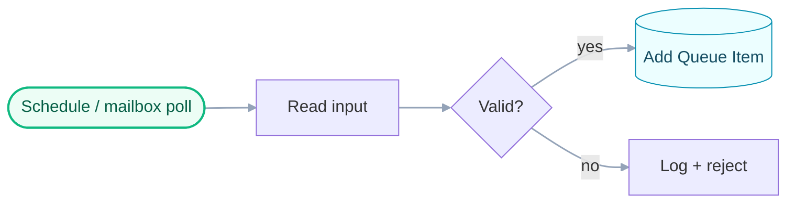

- **When to use**: scheduled or event-triggered intake; producer side of a
  Dispatcher/Performer split.
- **When not to use**: long-running per-item processing; use Performer or LRW.
- **Required activities**: `UiPath.Mail.Activities.GetIMAPMailMessages` (or
  connector-specific intake), `UiPath.Core.Activities.AddQueueItem`,
  `UiPath.Core.Activities.LogMessage` (correlationId).
- **CLI**: `uipcli package restore | analyze | pack`.
- **Skills**: `[skill:uipath-rpa]`, `[skill:uipath-platform]`. **MCP**:
  `uipath_doc_get_activity`, `uipath_library_search`.

---

## Performer / Queue Worker (RPA, Flowchart)

Per-item processor.

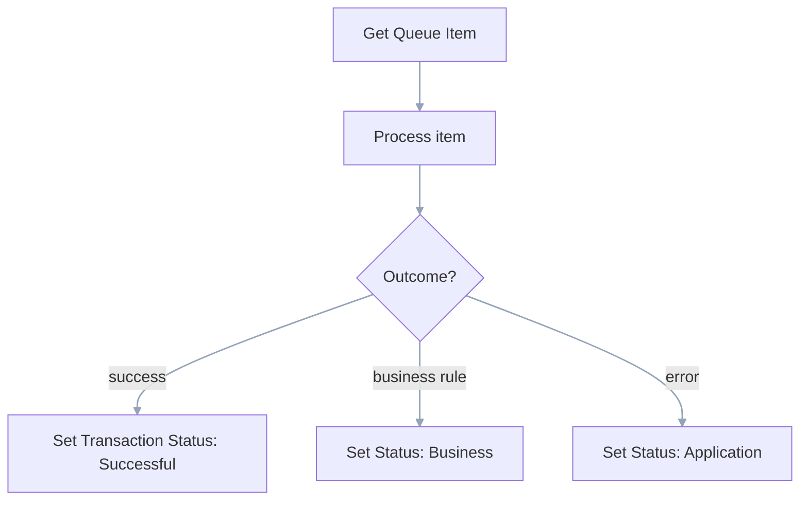

- **When to use**: deterministic per-item processing.
- **When not to use**: human waits crossing job boundaries (use LRW).
- **Required activities**: `GetTransactionItem`, `SetTransactionStatus`.
- **Skills**: `[skill:uipath-rpa]`. **MCP**: `uipath_doc_get_activity`.

---

## Long Running Workflow (RPA, persisted)

Orchestrator-persisted workflow that suspends across human or external events.

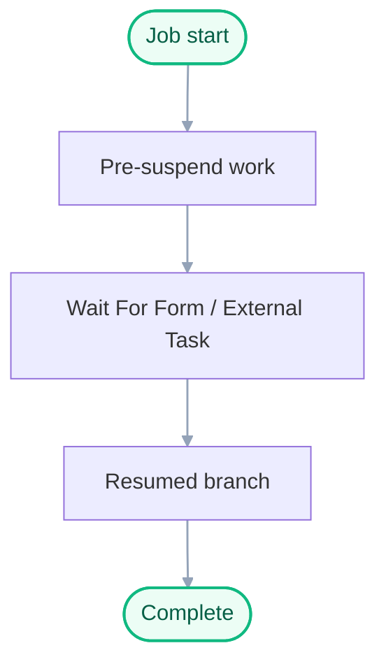

- **When to use**: process truly waits for human or external system.
- **When not to use**: synchronous deterministic work — use Sequence/Flowchart.
- **Required activities**: `WaitForForm`, `WaitForExternalTaskAndResume`,
  `CreateExternalTask`.
- **Skills**: `[skill:uipath-rpa]`, `[skill:uipath-custom-hitl]`.

---

## Custom HITL (Action Center External Tasks + Slack Adaptive Cards)

The org-standard HITL: External Tasks combined with the
[`cato-networks-IT/HITL_Application`](https://github.com/cato-networks-IT/HITL_Application)
(Adaptive Cards + Slack approval).

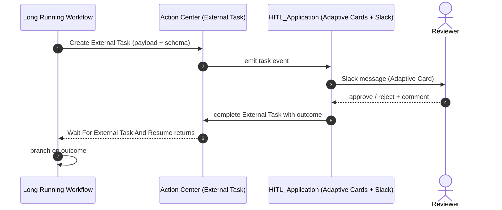

- **When to use**: any human approval / data-enrichment / write-back gate where
  the org wants Slack-based UX with audit trail.
- **When not to use**: Action Center forms only (use plain LRW + WaitForForm).
- **Flow-owned HITL override**: if accepted spec/plan explicitly assigns HITL to
  Flow, use the `Flow-owned HITL` pattern below and document the override in
  `plan.md` routing.
- **Required activities**: `CreateExternalTask`, `WaitForExternalTaskAndResume`,
  HITL_Application webhook config (Slack channel, card schema, callback URL).
- **CLI**: `uipcli package analyze | pack`; HITL_Application deployed
  separately.
- **Skills**: `[skill:uipath-custom-hitl]`, `[skill:uipath-rpa]`.
- **MCP**: `uipath_doc_get_activity` (External Task activities),
  `uipath_library_search` (`Action Center External Tasks`).
- **Verification evidence**: external-task creation log + resume outcome log +
  audit correlation id.

---

## LangGraph Coded Agent

Stateful agent with named graph + nodes.

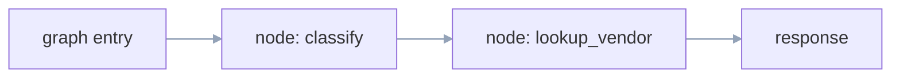

- **When to use**: stateful reasoning, branching, tool-calling.
- **When not to use**: pure document retrieval (use LlamaIndex).
- **Required artifacts**: `langgraph.json`, `main.py:graph`, request/response
  schema. **Model**: UiPath LLM Gateway via `uipath_langchain.chat.UiPathChat`.
- **CLI**: `uipath run`, `uv run pytest`, `uipath pack | publish`.
- **Skills**: `[skill:uipath-agents]`.

---

## LlamaIndex Coded Agent

Document-heavy retrieval / index-backed agent.

- **When to use**: retrieval over a corpus.
- **When not to use**: stateful tool-calling — use LangGraph.
- **Required artifacts**: `llama_index.json`, indexer + query entrypoint.

---

## Maestro / BPMN Flow

Studio Web BPMN flow (`.bpmn` / `.flow`).

- **When to use**: cross-system process orchestration with explicit BPMN events.
- **When not to use**: simple worker loops — use Sequence/Flowchart.
- **Skills**: `[skill:uipath-maestro-flow]`.
- **Verification evidence**: flow validate output + runtime debug/smoke trace.

---

## Coded App / Coded Action App

TypeScript-backed app surfaces.

- **Required artifacts**: `app.config.json`, `action-schema.json`, `src/`.
- **CLI**: `uip codedapp build | test | deploy`.
- **Skills**: `[skill:uipath-coded-apps]`.

---

## API Workflow

`api-workflow.json` for synchronous API-style workflows.

- **CLI**: `uipcli package` verbs.
- **Skills**: `[skill:uipath-rpa]`.

---

## Email Intake (connector)

UiPath.Mail.Activities or Integration Service Email connector.

- **When to use**: mailbox polling for Dispatcher.
- **Required activities**: `GetIMAPMailMessages` /
  `UiPath.Email.Activities.Office365.GetMailMessages`.
- **Verification evidence**: connector auth check + intake sample evidence with
  non-stub message identifiers.

---

## Queues / Buckets / Data Fabric

Platform-level data planes.

- **Queues**: `AddQueueItem`, `GetTransactionItem`, `SetTransactionStatus`.
- **Buckets**: `UiPath.Storage.Activities` for blob I/O.
- **Data Fabric**: `uip df` for entity/record CRUD;
  `[skill:uipath-data-fabric]`.

---

## Flow-owned HITL

Use Flow itself as the HITL canvas when the accepted spec explicitly requires
it (override of custom HITL default).

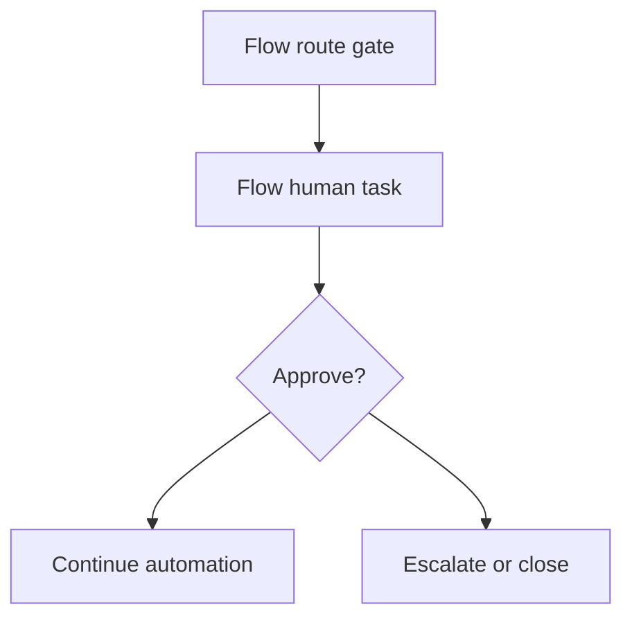

- **When to use**: plan/spec explicitly requires HITL inside Flow.
- **When not to use**: standard org custom HITL via Action Center + Slack app.
- **Required artifacts**: `.flow` task node schema, assignee mapping, timeout/escalation.
- **CLI**: `uip flow validate` and flow runtime smoke where safe.
- **Skills**: `[skill:uipath-maestro-flow]`, `[skill:uipath-human-in-the-loop]`.
- **Verification evidence**: validation log + approve/reject path evidence.

---

## Agent Invocation Boundary (hosted by RPA or Flow)

Explicit boundary between host workflow and coded agent runtime.

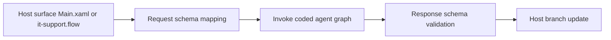

- **When to use**: RPA/Flow invokes LangGraph/LlamaIndex for semantic decisions.
- **When not to use**: deterministic-only branches that do not require LLM reasoning.
- **Required artifacts**: host invocation step, `langgraph.json` or `llama_index.json`,
  request/response schema mapping in plan/tasks.
- **CLI**: host verify command + `uipath run` or pytest for agent surface.
- **Skills**: `[skill:uipath-rpa]`, `[skill:uipath-maestro-flow]`, `[skill:uipath-agents]`.
- **Verification evidence**: host logs + agent run output + mapped schema assertions.

---

## DMN Policy Decision Boundary

Deterministic decision layer separating policy from semantic reasoning.

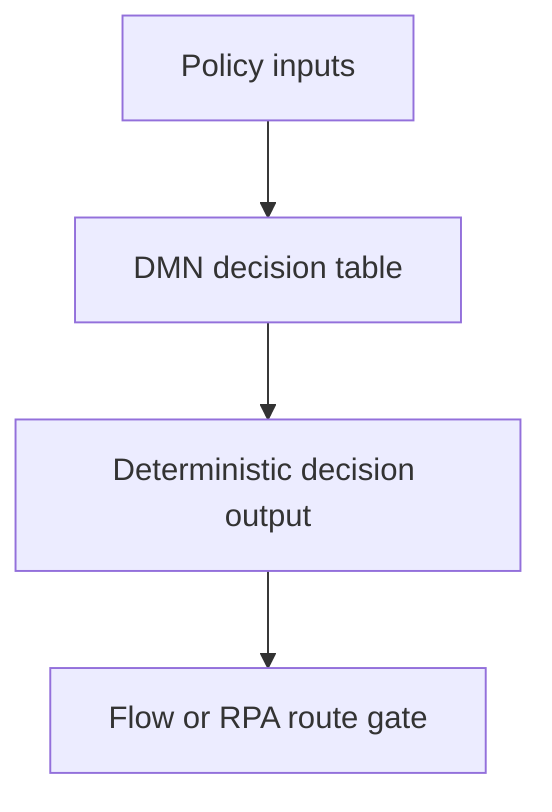

- **When to use**: approval/escalation/compliance routing that must be deterministic.
- **When not to use**: fuzzy classification better handled by agent.
- **Required artifacts**: `.dmn` file + policy IO schema + host invocation row.
- **CLI**: DMN test command (`pytest` or equivalent policy test harness).
- **Skills**: `[skill:dmn-business-rules]`, `[skill:uipath-maestro-flow]`.
- **Verification evidence**: DMN test report + host branch evidence for each decision path.

---

## Studio-visible Logging Contract

Cross-surface logging pattern that must be visible in Studio/job logs.

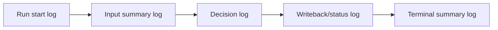

- **When to use**: all executable workflow surfaces (`.xaml`, `.flow`, hosted agent boundaries).
- **Required logs**: start, input summary (non-PII), decision branch, status transition,
  exceptions, terminal summary.
- **Correlation**: propagate one correlation id across invoked surfaces.
- **Verification evidence**: log assertions for correlation id + expected phase markers.

---

## Platform Resource Provisioning

Orchestrator resource lifecycle for queues, assets, folders, connections, and bindings.

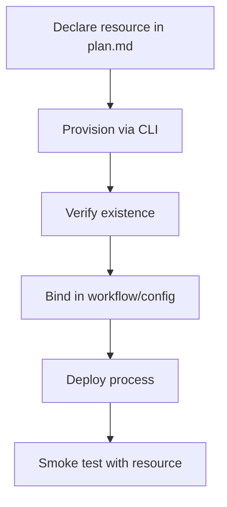

- **When to use**: any automation that uses Orchestrator queues, assets, folders,
  connections, or bindings.
- **When not to use**: local-only tests with no Orchestrator dependency.
- **Required steps** (see [ACTIVITY_AND_RUNTIME_EVIDENCE.md](../../docs/uiplan/ACTIVITY_AND_RUNTIME_EVIDENCE.md)
  §Orchestrator resource lifecycle):
  1. Declare in `plan.md` Bindings and Environment with target folder, provisioning
     command, verification command, evidence path, and secret boundary.
  2. Provision:
     - Queues: `uip or queues create --name <name> --folder-id <id> --output json`
     - Assets (non-secret): `uip or assets create --name <name> --type Text --value <value> --folder-id <id> --output json`
     - Assets (secret): mark `[HANDOFF:Secrets]` and document expected asset name/type
     - Folders: usually pre-existing; if new folder required, `uip or folders create` with approval
     - Connections: Integration Service or Studio Web connectors; record connection name and OAuth handoff
  3. Verify existence:
     - `uip or queues list --folder-id <id> --filter "name eq '<name>'" --output json`
     - `uip or assets list --folder-id <id> --filter "name eq '<name>'" --output json`
     - `uip or folders get --id <id> --output json`
  4. Bind in workflow/config (queue name in `AddQueueItem`, asset name in `GetAsset`,
     connection ID in `.flow` or bindings file)
  5. Deploy process to same folder where resources exist
  6. Smoke test and verify queue items/asset values appear in evidence
- **CLI**: `uip or queues|assets|folders create|list|get`, `uipcli package deploy`, `uip or jobs start`, `uip or jobs logs`
- **Skills**: `[skill:uipath-platform]`, `[skill:uipath-rpa]`, `[skill:uipath-maestro-flow]`
- **MCP**: `uipath_library_search` for queue/asset guidance
- **Verification evidence**:
  - Provisioning output: `out/queue-create.json`, `out/asset-create.json`, etc.
  - Verification output: `out/queue-verify.json`, `out/asset-verify.json`, etc.
  - Deployment output: `out/deploy.json` with process key
  - Job logs: `out/job-logs.json` with queue item IDs or asset references
  - Queue items: `out/queue-items.json` showing items added by the process
  - OR structured blocker: `out/tenant-blocker.json` when credentials/permissions unavailable

---

## UAT / UiPath Test-Case Validation

Automated or manual test evidence for production-bound stories.

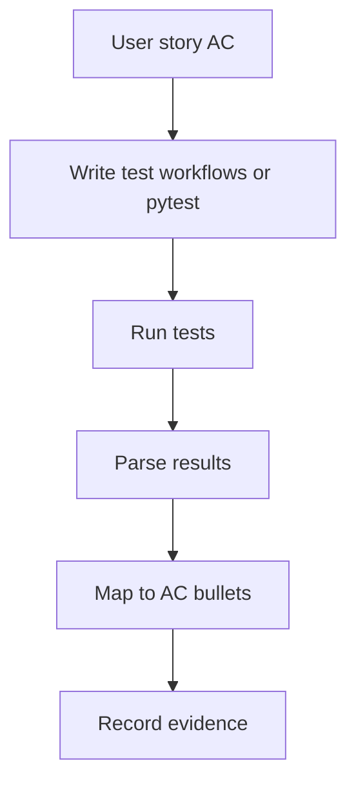

- **When to use**: every production-bound user story in `spec.md`.
- **When not to use**: analyzer/pack-only validation (not sufficient for UAT).
- **Test artifact types** (see [ACTIVITY_AND_RUNTIME_EVIDENCE.md](../../docs/uiplan/ACTIVITY_AND_RUNTIME_EVIDENCE.md)
  §UAT/test evidence):
  1. **UiPath Testing Activities** (RPA/XAML):
     - Create test workflows under `Tests/` using `UiPath.Testing.Activities` package
     - Use `Test Case`, `Given`, `When`, `Then`, `Verify Expression`, `Run Test Case` activities
     - Run via `uipcli test run -a <projectKey> <projectPath>`
     - Capture JUnit/NUnit XML or JSON output
  2. **pytest / eval** (coded agents):
     - Write pytest modules under `tests/` for happy-path and failure-path scenarios
     - Run `uv run pytest tests/test_<agent>.py -q --tb=short`
     - For agents with eval sets, run `uipath eval --eval-set <set> --output-file out/eval.json`
  3. **Manual Studio UAT** (when automated tests not feasible):
     - Document manual UAT scenario in `tasks.md` with step-by-step instructions
     - Execute scenario and capture evidence (screenshots, log files, Studio session recording)
     - Record results in `out/uat-manual-results.md` or `out/uat-session-log.json`
- **CLI**:
  - RPA: `uipcli test run -a <projectKey> <projectPath>`
  - Agents: `uv run pytest <test-module> -q`, `uipath eval --eval-set <set>`
  - Manual: documented steps + evidence capture
- **Skills**: `[skill:uipath-test]`, `[skill:uipath-rpa]`, `[skill:uipath-agents]`
- **Verification evidence**:
  - Test results: `out/test-results.xml` (RPA), `out/pytest-results.txt` (agents), `out/eval.json` (agent eval)
  - AC mapping table: which tests prove which acceptance criteria from `spec.md`
  - Test execution logs: `out/test-execution.log` with pass/fail counts and failure messages
  - Manual UAT: `out/uat-manual-results.md` with completed checklist and attached evidence files
- **Forbidden**: claiming UAT complete from analyzer/pack success alone; test workflows
  with only `LogMessage "Test placeholder"` are not valid UAT evidence
